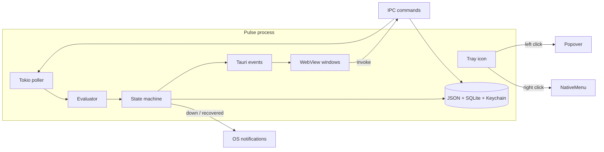
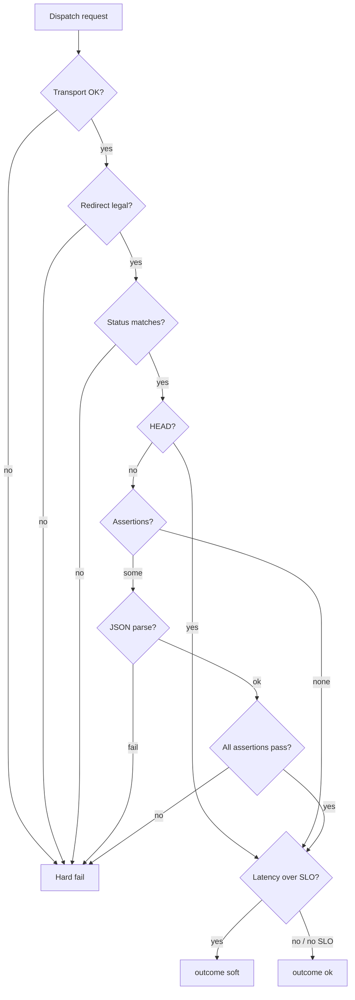
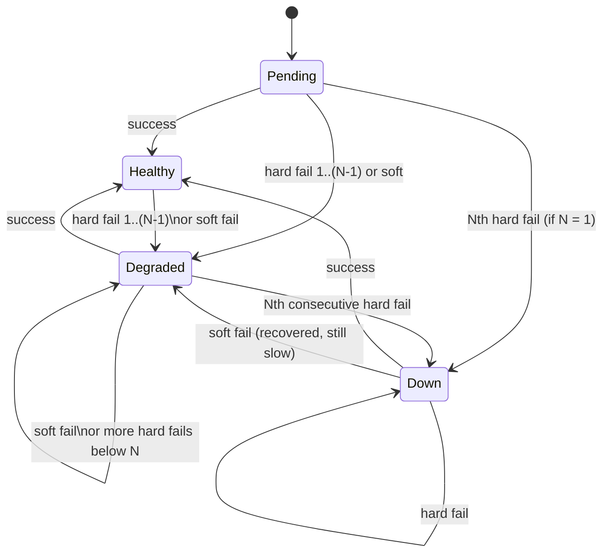
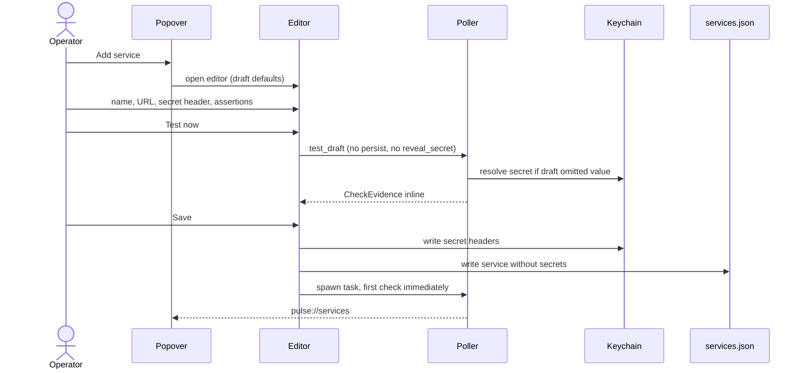
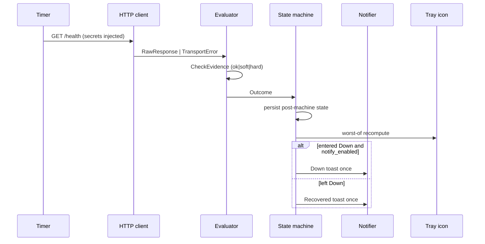
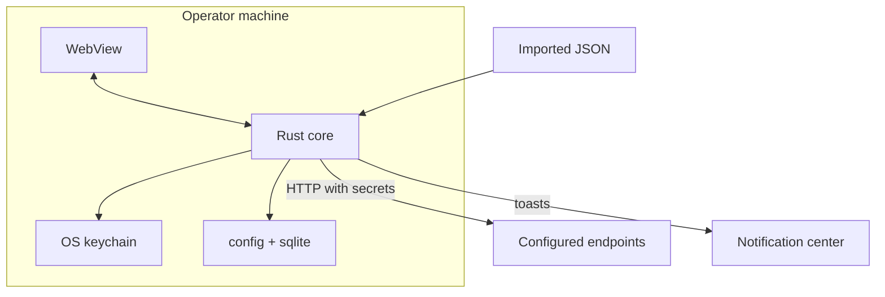

# Pulse — Tray Service Health Monitor

| Field | Value |
|---|---|
| **Document** | Technical Design |
| **Product** | Pulse |
| **Author** | TBD |
| **Date** | 2026-08-18 |
| **Status** | Approved |
| **Audience** | Implementing engineers |
| **Version** | 1.4 (v1 product, open questions resolved) |

---

## Overview

Pulse is a local-only Mac and Windows desktop app that lives in the menu bar / system tray and polls HTTP health endpoints the operator already knows. The tray icon is the product: green means every configured service passed its last evaluated check, amber means something is slow or has failed fewer times than the flap threshold, red plus a count means one or more services are down. Configuring a real authenticated check — URL, method, secret headers, status class, JSON assertions, optional latency SLO — takes under a minute. There is no account, no cloud, no public status page.

The core loop is a Rust process: a staggered per-service scheduler, an HTTP client that honors the OS trust store and system proxy, a deterministic evaluator, a small state machine that damps flaps, and OS notifications that fire once on down and once on recovery. A thin Tauri 2 + React UI renders four surfaces: tray popover (created at launch), plus service detail, add/edit, and settings windows created on first open and destroyed on close. Secret header values live in the OS keychain and are never written to the readable config JSON, logs, or crash reports. Notification bodies carry the service name and a reason *class* (status code, timeout, “assertion failed”) — never assertion expected/actual values, headers, or body previews.

---

## Background & Motivation

“Is it up?” for a personal stack is a solved problem that is still annoying. Browser tabs get buried. UptimeRobot / Better Stack / Datadog are the right tool for a team on-call rotation and the wrong tool for “I shipped a side-project API and a homelab NAS and I want the menu bar to go red.” Those products require an account, a hosted poller (which cannot see localhost or RFC1918), and a notification pipeline that is heavier than a single operator.

Pain today:

- Hosted checkers cannot reach `localhost`, Tailscale names, or a NAS on `192.168.1.4`.
- A single timeout becomes an incident if the tool has no degraded state.
- Putting `Authorization: Bearer …` in a cloud check is a secret-exfiltration decision.
- The signal is in another tab, not in the ambient strip the operator already looks at.

Pulse is a quiet resident process. It wins if a down service is visible within one poll cycle without opening a window, a blip does not page, and secrets stay on the machine.

This is a greenfield repo. The workspace at `/Users/praveen/Work/Personal/pulse` has no existing code. Everything below is the system to build.

---

## Goals & Non-Goals

### Goals (v1)

- Menu-bar / tray resident app. No dock or taskbar window required to be useful.
- HTTP checks: `GET` | `HEAD` | `POST`, custom headers, interval, timeout.
- Healthy iff expected status **and** all body assertions pass; optional max-latency SLO.
- Flap damping, degraded vs down, recovery notification, snooze, pause, check-now.
- Secret headers write-only after save; OS keychain; never logged or notified.
- Quiet hours with digest; per-service **Always alert** bypass.
- Import / export JSON (services only, or services + secrets behind an explicit warning).
- Launch at login, optional global hotkey, 24-check sparkline + 24h compact history.
- Single codebase, Mac + Windows, local-only.

### Non-Goals (v1)

- Accounts, team sync, shared workspaces, public status page.
- TCP / ICMP / gRPC / TLS-cert-expiry as first-class check types (cert expiry is v1.1).
- Outbound webhooks, PagerDuty, Slack (v1.1).
- mTLS, custom CA bundles (v1.1).
- Auto-discovery, editing production systems, AI RCA, mobile companion.
- Historical graphs beyond the 24h sparkline.

### Explicitly out (any version)

- Public status page.
- Auto-discovery of services.
- Mutating the monitored system from Pulse (restart, deploy, SSH).
- AI root-cause analysis.
- **Linux.** Never. Mac and Windows only. No Linux tray, no `pulse-cli`, no “keep crates OS-agnostic for later.” A third tray is out of scope for the life of this product.
- **App stores.** No Mac App Store, no Microsoft Store. Distribution is **direct download only** (notarized Mac DMG + Windows NSIS from GitHub Releases). Store sandboxes block localhost/LAN checks and complicate the keychain.

---

## Key Decisions

These are locked for v1. Rationale is short here; the corresponding section has the full spec.

| # | Decision | Choice | Rationale |
|---|---|---|---|
| 1 | Snooze visual | **Tray stays red / amber (truthful).** Row gets a `Snoozed` pill. | Thesis is “green means go.” Snooze suppresses *notifications*, not ambient truth. A snoozed-mark tray would hide an outage the operator asked only to stop being pinged about. |
| 2 | Assertion paths | **Dot-path:** `path := '$' rest \| first rest`. JSONPath-lite, not JSON Pointer. | Matches `status`, `$.status`, `$.data.healthy`. Pointer (`/data/healthy`) is less familiar. One grammar; see [Assertion path syntax](#assertion-path-syntax). |
| 3 | `errors.length == 0` | **`.length` accessor** + existing `equals` / `gt` / `lt`. Also allow `errors` `equals` `[]`. | Does not grow the operator set. `.length` on arrays/strings is the accessor; on objects it is the field. |
| 4 | Degraded vs down | **Hard fail → degraded, then down after N.** Soft fail (2xx + slow, assertions pass) stays degraded and never notifies. | See [Classification matrix](#degraded-vs-down-classification-matrix). Health payloads that return 200 + `status: "unhealthy"` *are* hard fails (assertion miss). |
| 5 | Stack | **Tauri 2 + Rust 2021 + React 19 + TypeScript + Vite.** | One codebase. Pulse payload target < 20 MB (not payload + Chromium). One WebView at idle (popover only). Tray / notifications / autostart / updater plugins, `keyring` for OS secrets, tokio/reqwest for the poller. Electron’s 150 MB + 150 MB idle is wrong for a 24/7 tray process. Dual native (Swift + WinUI) is two products. |
| 6 | Secrets | **OS keychain** (macOS Keychain, Windows Credential Manager). Config JSON is plaintext minus secret *values*. | App-level encryption just moves the key into the keychain. Per-header keychain items make secret-free export the default path. |
| 7 | Polling | Per-service tokio task, **stagger on start**, **concurrency 4**, no backoff on failure, overdue-interval + OS wake, offline mode when ≥2 hosts fail transport. | Failure must keep polling at the configured interval so recovery is fast. Backoff would hide the recovery the product promises. |
| 8 | Persistence | Tauri `path().app_config_dir()` for identifier `dev.pulsebar.app`: `~/Library/Application Support/dev.pulsebar.app/` (macOS) and `%APPDATA%\dev.pulsebar.app\` (Windows). Files sit **in that directory** (no extra `config` leaf). JSON + SQLite. `schemaVersion: 1`. | One resolver, one path. The `directories` crate and a hand-rolled `pulsebar\pulse` layout would disagree with Tauri and with each other; we do not use them. |
| 9 | History | Full evidence for **last result only**. Compact sample **every applied check for 24h** stores **post-machine `state` plus `outcome`**. Sparkline plots machine state (amber until threshold, then red). `canceled` and **offline-frozen** probes are not sampled (sparkline gap). Cap 2 000 rows/service. | 20 services × 60 s ≈ 28 k rows/day, trivial. Body previews are 2 KB and must not accumulate. |
| 10 | Name | **Keep Pulse.** Installer title “Pulse — Service Monitor.” Bundle ID `dev.pulsebar.app`. | Short, fits the menu bar, matches the heartbeat mark. Collision with Pulse Secure / Ivanti is handled by the installer title and bundle id — **not** by renaming to Pulsebar or Stillup. Final. |
| 17 | Distribution | **Direct download only** from GitHub Releases. Notarized Mac DMG + Windows NSIS. No Mac App Store, no Microsoft Store. | Store sandbox would block localhost/LAN checks and complicate keychain. Updater already points at GitHub Releases. |
| 18 | Platforms | **macOS + Windows only. Linux never.** | A third tray (and a `pulse-cli`) would split a solo builder. Do not design for it. |
| 11 | Outbound webhook | **v1.1, not v1.** | First time Pulse sends data to a URL the operator did not put in a check. Needs its own secret handling, quiet-hours digest, and retry policy. Would delay the tray loop. |
| 12 | Fail threshold default | **3.** | Interval default is 60 s. Threshold 2 turns one blip + one slow GC into an incident. Threshold 3 = ~2–3 min to red, while amber still appears on the first fail (product win #1: visible in one cycle). |
| 13 | HEAD | Allowed. **Assertions skipped**, not failed, when method is `HEAD`. Editor disables the assertion list. | HEAD has no body. Failing assertions would make HEAD unusable. |
| 14 | HTTP policy | Follow ≤3 redirects by default (`followRedirects: true`); **no HTTPS→HTTP**; **strip all secret headers on host or scheme change**; TLS via **native-tls** (OS trust store); system proxy + env (`macos-system-configuration` feature); OS dual-stack order (not Happy Eyeballs). No custom CA, no mTLS. | Corp MITM / private CAs are v1.1. Cross-host 302s must not forward `X-Api-Key`. `followRedirects: false` exists so a check can expect 3xx. |
| 15 | Detail surface | **Utility window, not a popover sheet.** ~420×560. Opening it **closes the popover**. | Menu-bar popovers dismiss on focus loss. Detail must stay up while the operator copies a body, compares expected vs actual, and hits Open. The brief said “sheet”; this is an intentional override. |
| 16 | Windows tray UI | **Same custom popover** (borderless webview), not a native `HMENU`. Right-click = native fallback menu (Check all / Settings / Quit). | A native Windows tray menu cannot render status pills, relative times, or a footer. We will not achieve pixel-identical attachment; we will achieve the same information architecture. |

**Disagreements with the brief (not silent drops):**

- Detail is a window, not a sheet (decision 15). All other v1 and “strong v1” features are kept, including snooze, quiet hours, 24h sparkline, secret headers, latency SLO, and import/export.
- Launch-at-login defaults to **off**. After the first service is saved, Pulse prompts once. Installing a login item before the user has a check is rude and fails Gatekeeper / SmartScreen scrutiny.
- `POST` is allowed but the editor warns: polls have side effects if the endpoint is not idempotent. No `PUT`/`PATCH`/`DELETE` in v1.
- New services are **`pending`**, not green, until the first `on_result`. They do not count as healthy for the tray worst-of.
- Secret-header support ships in unsigned v1. A later Developer ID / Authenticode identity change cannot read the old keychain items — the UI prompts “Re-enter secret headers,” never falls back to plaintext.

---

## Proposed Design

### Repository layout

Greenfield. This is the tree to create; no paths below exist yet.

```
pulse/
├── package.json
├── pnpm-workspace.yaml
├── tsconfig.json
├── vite.config.ts
├── index.html
├── README.md
├── LICENSE
├── schema/
│   ├── pulse-export.schema.json      # import/export JSON Schema draft 2020-12
│   └── pulse-config.schema.json      # on-disk config.json + services.json
├── src/                              # React UI (renderer)
│   ├── main.tsx
│   ├── app.tsx                       # window router by ?window= label
│   ├── styles/
│   │   ├── tokens.css                # tech-utility palette
│   │   └── reset.css
│   ├── lib/
│   │   ├── types.ts                  # mirrors Rust domain types
│   │   ├── ipc.ts                    # typed invoke wrappers
│   │   ├── format.ts                 # relative time, latency, status labels
│   │   └── assertPath.ts             # path helper examples (UI only)
│   ├── state/
│   │   └── store.ts                  # zustand: services, settings, selection
│   └── ui/
│       ├── popover/
│       │   ├── Popover.tsx
│       │   ├── SummaryStrip.tsx
│       │   ├── ServiceRow.tsx
│       │   └── Footer.tsx
│       ├── detail/
│       │   ├── DetailWindow.tsx
│       │   ├── Evidence.tsx
│       │   └── Sparkline.tsx
│       ├── editor/
│       │   ├── EditorWindow.tsx
│       │   ├── HeadersField.tsx
│       │   ├── AssertionsField.tsx
│       │   └── TestNowPanel.tsx
│       ├── settings/
│       │   └── SettingsWindow.tsx
│       └── shared/
│           ├── StatusMark.tsx        # geometric mark + text label
│           ├── SecretValue.tsx       # press-and-hold reveal
│           └── TimeAgo.tsx
├── src-tauri/
│   ├── Cargo.toml
│   ├── tauri.conf.json
│   ├── capabilities/
│   │   ├── popover.json              # no reveal_secret
│   │   ├── detail.json
│   │   ├── editor.json
│   │   └── settings.json
│   ├── icons/
│   ├── Info.plist                    # LSUIElement = true
│   └── src/
│       ├── main.rs
│       ├── lib.rs                    # app builder, plugins, windows
│       ├── domain/
│       │   ├── mod.rs
│       │   ├── service.rs
│       │   ├── result.rs
│       │   ├── settings.rs
│       │   ├── assertion.rs
│       │   └── error.rs
│       ├── eval/
│       │   ├── mod.rs
│       │   ├── path.rs               # dot-path resolver + .length
│       │   ├── compare.rs            # operators + coercion
│       │   └── classify.rs           # hard vs soft
│       ├── poller/
│       │   ├── mod.rs
│       │   ├── scheduler.rs
│       │   ├── client.rs             # reqwest wrapper
│       │   ├── state_machine.rs
│       │   └── offline.rs
│       ├── store/
│       │   ├── mod.rs
│       │   ├── paths.rs
│       │   ├── config.rs             # config.json + services.json
│       │   ├── history.rs            # sqlite
│       │   ├── secrets.rs            # keyring
│       │   └── migrate.rs
│       ├── notify/
│       │   ├── mod.rs
│       │   ├── copy.rs
│       │   └── quiet.rs
│       ├── platform/
│       │   ├── mod.rs
│       │   ├── autostart.rs
│       │   ├── wake.rs
│       │   └── tray.rs               # icon painting + click
│       └── ipc/
│           ├── mod.rs
│           └── commands.rs
├── tests/
│   ├── eval/                         # fixtures: health payloads + expected
│   └── import/                       # valid / malicious export files
└── .github/workflows/
    ├── ci.yml
    └── release.yml
```

Package manager: **pnpm**. Rust edition 2021, tokio full, Tauri `2.x`.

### Process and window model

Pulse is a single OS process. The WebView is not the poller. If the UI is never opened, checks still run.



**One WebView at idle.** Only `popover` is created at launch (hidden). `detail`, `editor`, and `settings` are created on first open and **destroyed on close**. Recreating is cheaper than four resident WebView2 processes, which would blow the idle RAM budget on day one.

| Label | Role | Size | Decorations | Lifetime |
|---|---|---|---|---|
| `popover` | Glance list | 372 × 480 (height grows to 560, then scrolls) | None, always-on-top; skip taskbar/dock | Created at launch, hidden when dismissed |
| `detail` | Evidence | 420 × 560 | Standard utility | On demand; destroy on close |
| `editor` | Add / edit | 440 × 640 | Standard utility | On demand; destroy on close |
| `settings` | Preferences | 440 × 560 | Standard utility | On demand; destroy on close |

macOS: set **both** `tauri.conf.json` → `app.macOSPrivateApi` not required; `app.windows` is irrelevant — use `bundle.macOS` / `app.macOS` **`activationPolicy: "accessory"`** *and* keep `LSUIElement = true` in the template Info.plist. Tauri regenerates Info.plist; a hand-edited plist alone is overwritten. No dock icon.

Windows: `bundle.windows.webviewInstallMode.type = "embedBootstrapper"` (~1.8 MB). This is **not** “embed the runtime.” Real Tauri 2 options: `downloadBootstrapper` (0 MB, needs net on first run), `embedBootstrapper` (~1.8 MB), `offlineInstaller` (~127 MB), `fixedRuntime` (~180 MB). Offline/fixed blow the installer budget. Win10 machines without WebView2 will download it via the bootstrapper on first launch; document that. `skipTaskbar: true` on `popover`.

Single-instance plugin: a second launch focuses the popover.

### Tray icon language

Painted assets, **not** template images. Template icons on macOS recolor to black/white and would destroy the status signal. Provide `@1x`/`@2x` (18/36 macOS, 16/32 Windows).

| State | Mark | Badge |
|---|---|---|
| All healthy (at least one unpaused service) | Filled 8 px circle, success token | None |
| Any degraded, none down | Filled circle, warn token | None |
| Any down | Filled circle, danger token | Integer count of **down** services only |
| All unpaused services are `pending`, or zero services, or all paused | Hollow 8 px circle, muted | None |
| Offline / no network | Filled circle + 1.5 px slash overlay, muted | None |
| Poller watchdog failed (`poller_dead`) | **Hollow circle + danger-colored slash** (not the empty mark) | None |
| Snoozed downs exist | **Unchanged** — still red + count | Count includes snoozed downs |

Snooze is visible on the **row as an extra pill**, not as the primary label and not on the tray. See [Snooze](#snooze).

The icon is the worst-of across unpaused, non-pending services: `down` > `degraded` > `healthy`. `pending` and `paused` do not contribute. If every unpaused service is `pending` (brand-new config, first checks in flight), the tray is the hollow mark — not green. Offline overrides color (slash) but does not clear internal state. `poller_dead` overrides everything else and also paints an error strip in the popover: “Pulse’s checker stopped — restart the app.” Do not reuse the empty/paused mark for a wedged poller.

### Information architecture

Two entry surfaces. Everything else is a window opened from them.

```
Tray icon
 └─ Popover
     ├─ Summary strip (Pulse · n services · n down)
     ├─ Service list (unhealthy first)
     ├─ Footer: Check all · Settings · Quit
     └─ Row click → Detail window (popover closes)
           └─ Edit → Editor window
     └─ Empty: one primary “Add service” + one-line hint

Settings window
 ├─ General (launch at login, hotkey, theme)
 ├─ Notifications (enabled, sound, quiet hours)
 ├─ Defaults (interval, timeout, fail threshold)
 └─ Data (export / import / reset)
```

No onboarding carousel. First launch opens the empty popover once so the user can find the app, then it stays in the tray.

### Popover behavior

- Width 372 px. Glance surface, not a dashboard.
- **Tray click vs blur (do not skip this).** This is the standard tray-popover race: clicking the icon to dismiss fires `blur`/`focus_lost` on the borderless window first (hide) and then the tray click (show), so a naive toggle flickers or cannot close.
  1. Tray **mouse-down** sets `suppress_blur_until = now + 250 ms`.
  2. If the popover receives blur inside that window, **ignore** the blur.
  3. Toggle visibility only on tray **mouse-up**.
  4. `Esc` and true click-outside (blur after the suppress window) still hide.
  5. A left-click while the native right-click menu is open dismisses that menu and does **not** toggle the popover (same suppress window).
  6. If `Shell_NotifyIconGetRect` fails or the icon is in the overflow flyout, position at work-area bottom-right minus 12 px and **do not toggle-fight** — show if hidden, leave shown if already shown.
- Position: macOS — flush under the status-item rect, end-aligned. Windows — above `Shell_NotifyIconGetRect`, end-aligned; overflow / rect-failure → work-area fallback above. Retry the rect once on the next click; do not loop.
- Sort: band `down` → `degraded` → `pending` → `paused` → `healthy`. Inside a band: longest time-in-state, then name (UTF-8 lexicographic, case-insensitive).
- Every row: geometric mark, a **primary text status label**, name, relative time in tabular figures (`12s ago` or `down 6m`). Status color is never the only signal.
  - Primary label is the machine / last-outcome label **only**: `Down` | `Slow` | `Degraded` | `Pending` | `Paused` | `Healthy`.
  - **`Snoozed · 59m` is an extra pill**, never the primary label. A snoozed down service still reads `Down`.
  - `Slow` vs `Degraded`: both are machine state `degraded`. Use `Slow` iff `lastResult.outcome == "soft"` (or `errorKind == "slow"`). Use `Degraded` for hard fails still under the flap threshold (and for a recovered-but-still-slow service that is in `degraded` after a soft fail — also `Slow`).
- Relative time: none when `pending` (`Checking…`); `now - last_check_at` when healthy; `now - down_since - down_clock_adjust` prefixed `down` when down; `degraded 3m` when degraded.
- Footer always visible. `+` in the header is the other Add affordance. If `poller_dead`, a danger strip sits above the list.
- Keyboard (popover focused): `Cmd/Ctrl+N` new service, `↑/↓` select, `R` check selected, `Enter` open action URL, `Shift+Enter` open detail, `P` pause, `Esc` close. No global key handling when the popover is hidden except the configured hotkey.

### Detail window

Override vs brief: this is a **window**. Contents:

1. Name, status label, worst-of reason line.
2. Last check: HTTP status, latency, timestamp (absolute + relative).
3. Assertion table: path, op, expected, actual, pass/fail.
4. Error line from the [error taxonomy](#error-taxonomy) — only when `errorKind` is a real failure. A passing HEAD with skipped assertions shows a muted note from `assertionSkipped`, not the error line.
5. Truncated body preview (mono, 2 KB), **Copy response**.
6. Sparkline of last 24 **post-machine** states + a second 24h strip (5-minute buckets, worst **machine** state in the bucket). First `N-1` hard fails plot amber; the Nth plots red. `canceled` and offline-frozen checks leave a gap, not a bar.
7. Actions: **Open** (action URL if set, else health URL), **Check now**, **Pause**, **Snooze ▾** (15 m / 60 m / until tomorrow 08:00 local), **Edit**.
8. Headers listed with secret values masked (`••••••••`). Press-and-hold the mask to reveal via IPC; release remasks. Not a sticky toggle.

### Editor window

Compact utility, ~440×640, form-dense, mono for URLs and paths.

Required: name, URL. Defaults on new service:

| Field | Default |
|---|---|
| method | `GET` |
| intervalSec | Settings `defaultInterval` (60) |
| timeoutMs | Settings `defaultTimeoutMs` (10 000) |
| expectedStatus | `"2xx"` |
| failThreshold | omitted (inherit Settings, default 3) |
| notify | `true` |
| alwaysAlert | `false` |
| paused | `false` |
| followRedirects | `true` |
| assertions | `[]` |
| maxLatencyMs | omitted |

**Test now** runs the same evaluator against the in-memory draft. It does **not** write history, does **not** start polling, and does **not** require `reveal_secret`. Header resolution is entirely on the Rust side — see [Test now secret resolution](#test-now-secret-resolution). A failing test does not block Save; Save on a draft that just failed Test now shows a confirm: “Last test failed. Save anyway?” If the user never clicked Test now, Save proceeds (first live poll is the test). Save returns a `ServiceView` in `pending`; the first live check is async and must complete before the row can be green.

Expected-status helper (verbatim): “We follow up to 3 redirects and evaluate the final status. Uncheck *Follow redirects* to treat the first response as final — required if you expect 3xx.” Numeric `3xx` in `expectedStatus` is rejected at save when `followRedirects` is true, with that helper as the error.

Switching method to `HEAD` collapses assertions with helper text: “HEAD responses have no body. Use GET to assert JSON.” Existing assertions are kept on the draft but ignored at eval time so a method toggle is reversible.

`POST` reveals a body textarea and a warning: “Pulse will POST this body on every poll. Only use an idempotent endpoint.”

### Settings window

Four sections as in the IA. Quiet hours: start time, end time, day-of-week bitset (default Mon–Fri). Overnight ranges (`22:00`–`08:00`) are valid — see [Quiet hours window](#quiet-hours-window) for the Friday-into-Saturday rule. Data section: Export (secrets checkbox + warning), Import (Rust-side file dialog), Reset (typed confirm `RESET`). Settings help also states: “If any check succeeds, Pulse assumes the network is up” (mixed LAN + public reachability).

### Visual system

`tech-utility`. Not a marketing site. Tokens in `src/styles/tokens.css`:

- Surfaces: `bg-0` #0E1014, `bg-1` #161A22, `bg-2` #1E242E.
- Hairline: `border` #2A3140 at 1 px.
- Text: `text-0` #E6E8EE, `text-1` #9AA3B2, `text-2` #6B7380.
- Mono: IBM Plex Mono or ui-monospace for URLs, paths, IDs, JSON.
- Sans: system UI (SF Pro / Segoe UI Variable).
- Status: `ok` #3DDC97, `warn` #F5B942, `down` #F0534A, `muted` #6B7380. Used **only** for status.
- One accent: `accent` #6EA8FE, for focus rings and primary buttons, never for status.
- Status pills: 12 px label, tinted 12% fill, 1 px token-colored border, geometric mark 6 px.
- Focus: 2 px accent ring. Hover must keep contrast ≥ 4.5:1 on text. No color-only hover.
- No emoji status. No marketing hero. No logo cloud.

Theme: `system | dark | light`. Light inverts surfaces; status hues stay the same (they already pass on white).

---

## Polling architecture

### Scheduler

Each service owns a tokio task. There is no global 1 Hz tick.

```text
on service start or unpause:
  delay = stagger(service)
  sleep(delay)
  loop:
    acquire concurrency semaphore (cap = 4)
    run_check(service)
    release
    sleep(intervalSec + jitter)
```

**Stagger.** On app start and on “check all”, service `i` of `n` (stable sort by id) waits `i * min(interval_i) / n` seconds, capped at 15 s. Purpose: 20 services must not fire in the same 10 ms and trip a shared rate limit.

**Jitter.** `±10%` of `intervalSec` on the *sleep after a check*, not on the first run. Cheap insurance if two laptops share a config.

**Concurrency.** Global `tokio::sync::Semaphore` of 4 (`fair` default). Personal load is 5–20 services. **Check-now shares the same semaphore with no priority.** A `Notify` does not jump a tokio fair semaphore; do not pretend it does. Manual checks wait their turn like everyone else. That is acceptable — 4 in-flight at 10 s timeout is the worst case, and the UI shows `Checking…` on the row immediately.

**No failure backoff.** A down service keeps its configured interval so recovery is visible on the next cycle. Product promise: recovery notification as soon as the endpoint is healthy again.

**Pause.** Task is aborted (or sits on a watch channel). Pause does not clear `last_result` or history. The row shows primary label `Paused` and the last known status mark at 40% opacity. In-flight requests are aborted as `canceled` (a no-op — see state machine). Pause intervals are subtracted from the downtime clock (same as lid-close).

**Check now / check all.** Bypass the remaining sleep. Check-all staggers 50 ms apart to stay under the semaphore without a thundering herd.

**Interval set.** UI offers `15 | 30 | 60 | 120 | 300 | 600` seconds only. Store the number, not an enum, so a future custom value is not a schema break. Reject `< 15` on save.

### Sleep, wake, clock jump

Two independent mechanisms; either is sufficient, both ship.

1. **Overdue detector** (core). Before sleeping, record `next_due = now + interval`. On wake from the sleep, if `now - next_due > 2 * interval`, treat as a resume: wait 2 s, then run immediately. This covers sleep, a hung laptop, and NTP steps.
2. **OS resume** (fast path).
   - macOS: `NSWorkspaceDidWakeNotification` via `objc2`.
   - Windows: `WM_POWERBROADCAST` / `PBT_APMRESUMEAUTOMATIC` on a message-only window.

On resume: cancel in-flight requests as `canceled` (no-op on the state machine; they would time out on a dead NIC anyway), wait 2 s for the interface, run all unpaused services with the start stagger, do **not** increment fail counters for transport errors in the first 15 s after wake. If a quiet-hours window has ended while we slept, flush the digest queue (see [Quiet hours window](#quiet-hours-window)).

**Downtime clock.** Persist `down_since: DateTime<Utc>` when entering `down`. Displayed down duration = `now - down_since - down_clock_adjust_ms`. Recovery copy uses that duration.

Operator-intended silence is subtracted:

| Event | Adjustment |
|---|---|
| Laptop sleep | On sleep store `slept_at`. On wake add `(wake - slept_at)` if the service is still `down`. |
| Pause while `down` | On pause store `paused_at`. On unpause add `(unpause - paused_at)` if still `down`. |
| Offline freeze | Do not run the clock (state is frozen; `down_since` stays put and we add the offline interval on exit if still `down`). |

Snooze is **not** subtracted — the service is still down; we just are not toasting. A two-hour paused deploy then Recovered says `Recovered · down {pre-pause duration}`, not “down 2h+.”

### Offline detection

Do **not** ping `8.8.8.8` or `example.com`. Operators block those; Pulse should not invent its own health dependency.

```text
if a check fails with Unreachable | DnsFailure | ConnectTimeout
   AND at least 2 unpaused services exist
   AND at least 2 distinct hosts have that class of failure in the last 90 s:
     enter Offline
else if any check succeeds:
     exit Offline
```

While offline:

- Tray = slash overlay. No notification storm.
- Per-service fail counters **freeze**. A laptop on a train must not mark every service down.
- Polling continues (so we can exit offline). **Do not insert `check_samples` or overwrite `last_results` while frozen.** There is no honest `outcome` (`ok|soft|hard`) for an offline probe. Treat the gap like `canceled`: sparkline hole, log line only (`errorKind: offline`). Machine `state` is untouched.
- OS reachability (macOS `NWPathMonitor`, Windows `INetworkListManager`) is an optional hint to *exit* offline faster, never to *enter* it alone.

With a single configured service, offline cannot be distinguished from “that host is dead.” Treat it as a normal hard fail.

**Mixed reachability (Harbor-shaped stacks).** Exit-on-any-success means a still-up localhost or Tailscale NAS keeps Pulse “online” while every public host is dead (laptop on a train, homelab still reachable). That is **intentional** in v1: we will not invent an `8.8.8.8` dependency. Settings help, verbatim: “If any check succeeds, Pulse assumes the network is up. A homelab box that still answers will keep Pulse online even if the public internet is gone.” v1.1 candidate: ignore loopback / RFC1918 successes when classifying offline. Do not implement that in v1.

### Expected load

| Quantity | Target |
|---|---|
| Services | 1–20 typical, soft warn at 50, hard cap 100 |
| Default poll | 60 s, timeout 10 s, concurrency 4 |
| Idle RAM | One WebView (popover) + Rust: typically 40–80 MB. **Fail the budget above 120 MB idle.** Four resident WebViews are not the design. |
| Idle CPU | ~0 outside a check |
| Check latency budget | Evaluator < 2 ms; HTTP bound by `timeoutMs` |
| Installer | **Pulse payload** < 20 MB. WebView2 is *not* in that number: `embedBootstrapper` adds ~1.8 MB; the runtime is already on most Win10/11 machines or downloaded on first launch. Do not ship `offlineInstaller` / `fixedRuntime`. |
| History | < 10 MB SQLite after a week of 20 × 60 s |

---

## Evaluation algorithm

This section is the spec the unit tests are written against. Implementation lives in `src-tauri/src/eval/`.

### Outcome vs machine state (do not collapse these)

The evaluator never decides `degraded` vs `down`. Flap damping is the state machine’s job.

| Stage | Type | Values |
|---|---|---|
| Evaluator output | `CheckEvidence` | `outcome: ok \| soft \| hard` plus evidence fields. **No `ServiceStatus`.** |
| Mapping | `Outcome` enum | `Success` / `SoftFail` / `HardFail` — isomorphic to `ok` / `soft` / `hard`. |
| State machine input | `Outcome` | Plus `canceled` / `offline` sentinels that **do not** come from `evaluate()`. |
| State machine output | `ServiceStatus` plus `pending` | `pending` \| `healthy` \| `degraded` \| `down` |
| Persisted sample / sparkline | **Post-machine `state`** | So the Harbor detail “red run” is the Nth consecutive hard fail, not every hard fail. Also store `outcome` on the row for Slow vs Degraded. |

`evaluate()` → `Outcome` mapping:

| Pipeline result | `outcome` | `Outcome` | Notes |
|---|---|---|---|
| Status matches, assertions pass (or skipped), no SLO miss | `ok` | `Success` | |
| Same, but `latencyMs > maxLatencyMs` | `soft` | `SoftFail { Slow }` | Only soft path |
| Transport, redirect policy, status miss, body parse, assertion miss | `hard` | `HardFail { kind }` | Stop at first |
| Client abort (wake, pause mid-flight) | — | **Not evaluated** | `canceled`: state-machine no-op |
| Offline freeze | — | **Not applied** | No sample. Counters frozen. Log only. |
| Any check (Test now or live), secret header has no resolvable value | `hard` | `HardFail { missing_secret }` | No HTTP call |

`test_draft` returns `CheckEvidence` (no `state`). Live checks: `on_result` writes `CheckResult` = evidence + `state` (post-machine).

### Pipeline

Evaluate **in this order**. Stop at the first hard fail. Latency is last and is the only soft fail.

```text
1. Transport (DNS, TCP, TLS, timeout, reset, refused)
2. Redirect policy (too many, HTTPS→HTTP)
3. Status class / exact code
4. Body assertions (skipped for HEAD; parse fail is hard)
5. Latency SLO (soft)
```



### Classification matrix

| Condition | Class | Immediate UI | Escalates to `down` after N consecutive? | Notify on escalate? |
|---|---|---|---|---|
| TCP timeout / request timeout | Hard | Degraded | Yes | Yes |
| DNS resolution failure | Hard | Degraded | Yes | Yes |
| TLS untrusted / expired / hostname | Hard | Degraded | Yes | Yes |
| Connection refused | Hard | Degraded | Yes | Yes |
| Connection reset | Hard | Degraded | Yes | Yes |
| Network unreachable | Hard* | Degraded or Offline | Yes, unless Offline freeze | Yes, unless Offline |
| Too many redirects / HTTPS→HTTP | Hard | Degraded | Yes | Yes |
| 5xx (and not in `expectedStatus`) | Hard | Degraded | Yes | Yes |
| 4xx (and not expected) | Hard | Degraded | Yes | Yes |
| 3xx after following (`followRedirects: true`), final not expected | Hard | Degraded | Yes | Yes |
| First-hop 3xx when `followRedirects: false` and code is not in `expectedStatus` | Hard | Degraded | Yes | Yes |
| First-hop 3xx when `followRedirects: false` and code **is** expected | Success (then SLO) | Healthy if SLO ok | n/a | Recovery only |
| Expected status miss of any kind | Hard | Degraded | Yes | Yes |
| 2xx + body not JSON, assertions present | Hard | Degraded | Yes | Yes |
| 2xx + any assertion miss | Hard | Degraded | Yes | Yes |
| 2xx + assertions pass + slower than `maxLatencyMs` | **Soft** | Degraded (`Slow`) | **No** | **No** |
| 2xx + assertions pass + no SLO miss | Success | Healthy | n/a | Recovery only |
| HEAD + assertions configured | Assertions **skipped** | Follow status + latency only | — | — |
| 204 + assertions configured | Hard (body parse) | Degraded | Yes | Yes |

\* If offline mode engages, counters freeze and no notify.

**Why assertion miss is hard.** Many health endpoints return HTTP 200 with `{"status":"unhealthy"}`. Treating that as a permanent yellow would hide the exact outage Pulse exists to show. The operator opted into the assertion.

**Why latency is soft.** Slow is not down. A 900 ms `/health` against an 800 ms SLO should tint amber forever and never toast. If the operator wants slow to page, they can drop the SLO and assert on a server-side timing field instead. We do not add a “treat slow as hard” flag in v1.

### State machine

Per service, persisted across restarts (so a crash mid-outage does not send a second down toast or lose `down_since`).

```text
states: Pending | Healthy | Degraded | Down
counters: consecutive_hard_fails: u32
flags: paused, snoozed_until, notify, always_alert
```

A newly saved service is **`Pending`** (`consecutive_hard_fails = 0`, no `last_result`). Persist `runtime_state.status = 'pending'` until the first applied `on_result`. On boot, a missing `runtime_state` row is reconstructed as `Pending` (same as `last_check_at_ms IS NULL`). After the first applied result, the service never returns to `Pending` unless the operator deletes and recreates it. Do not invent a second reconstruction rule.

```text
on_result(outcome):
  if canceled: return                             # no state, counters, last_result, history
  if paused or offline: return                    # no transitions, no samples, no last_results

  if outcome == Success:
    was_down = (state == Down)
    duration = displayed_down_duration()
    consecutive_hard_fails = 0
    state = Healthy
    down_since = None
    if was_down and notify_enabled(): emit Recovered(duration)
    return

  if outcome == SoftFail:                         # Slow
    consecutive_hard_fails = 0                    # a slow 2xx is a successful reach
    if state == Down:
      duration = displayed_down_duration()
      state = Degraded
      down_since = None
      if notify_enabled(): emit Recovered(duration)
    else:
      # Healthy, Degraded, or Pending → Degraded (Slow). First-check SLO miss
      # must leave Pending. No notify.
      state = Degraded
    return

  if outcome == HardFail:
    consecutive_hard_fails += 1
    threshold = service.failThreshold ?? settings.failThreshold   # default 3
    if consecutive_hard_fails >= threshold:
      if state != Down:
        state = Down
        down_since = now()
        if notify_enabled() and not snoozed(): emit Down(outcome)
    else:
      state = Degraded
```



`canceled` is not a transition. Do not increment `consecutive_hard_fails`, do not write `last_results` or `check_samples`, do not change `state`. A lid-close or deploy-pause must not toast Down. The 15 s post-wake grace still applies to *applied* transport errors; it is unnecessary for `canceled` because those never reach this function as a fail.

**Notify once.** Entering `Down` notifies. Staying in `Down` does not. Leaving `Down` for `Healthy` or `Degraded` sends exactly one recovery. Flapping around the threshold *will* re-notify; that is correct — it left `Down`.

**`notify_enabled()`.** `settings.notifications && service.notify && (service.alwaysAlert || !in_quiet_hours()) && !snoozed() && !keychainIdentityChanged`. A signing-identity miss still transitions state (the row must show the failure) but must not toast while the re-enter prompt is up.

### Assertion path syntax

Locked: **dot-path with optional `$` prefix.** Not JSON Pointer. Not full JSONPath (`..`, `*`, filters are out).

Grammar (normative — do not invent a third variant):

```
path     := '$' rest | first rest
first    := ident | index | '[' index ']' | '[' string ']'
rest     := ( '.' ident | '.' index | '[' index ']' | '[' string ']' )*
ident    := [A-Za-z_][A-Za-z0-9_]*
index    := [0-9]+
string   := '"' [^"]* '"' | "'" [^']* "'"
```

`$` is either the whole path (`rest` empty) or a prefix followed by `rest` (which already includes `.ident` and `[…]`). `first` is never prefixed with `$`.

| Input | Parse |
|---|---|
| `$` | `'$' rest` with empty `rest` |
| `status` | `first=ident`, empty `rest` |
| `$.status` | `'$' rest` with `rest=.status` |
| `$.data.healthy` | `'$' rest` with `rest=.data.healthy` |
| `items.0.id` | `first=ident`, `rest=.0.id` |
| `items[0].id` | `first=ident`, `rest=[0].id` |
| `["error-code"]` | `first=["error-code"]`, empty `rest` |
| `$["error-code"]` | `'$' rest` with `rest=["error-code"]` |
| `errors.length` | `first=ident`, `rest=.length` |
| `items["0"].id` | `first=ident`, `rest=["0"].id` |
| `error-code` | **INVALID** — hyphen in a bare ident |

Required PR 4 parser fixtures: every row in that table (must-accept except `error-code`, which is must-reject `invalid_path`). `$` **alone** is the document root. `items.0.id` and `items[0].id` are equivalent on an array.

Hyphenated or otherwise non-`ident` **bare** words (`error-code`, `content-type`) are `invalid_path`. They **require** bracket form: `["error-code"]` or `$["error-code"]`.

Resolution starts at the JSON root. Each `.ident` / `.index` / `[n]` / `["key"]` steps once. Missing step → path miss (`actual` missing).

Editor helper text, verbatim (replaces the earlier draft):

> Paths are dot notation from the JSON root. `$` is optional. `$` alone is the root.
> `status` · `$.status` · `$.data.healthy` · `items.0.id` · `items[0].id` · `errors.length`
> Hyphenated keys need brackets: `["error-code"]` or `$["error-code"]`.
> `length` is the array or string length. To read a field named `length`, use `obj["length"]`.

**`.length` accessor.** If the segment is `length` (dot form, not `["length"]`) and the current value is an **array** or a **string**, the step returns that value’s length as a JSON number. If the current value is an **object**, `length` is a normal field lookup. `["length"]` is always a field lookup, never the accessor. This is how a document with a field literally named `length` is addressed: `meta["length"]`.

Invalid *parsed* paths that miss a step fail the assertion with `actual = <missing>` (not a transport error). Invalid *syntax* fails with `reason: "invalid_path"`.

### Operators and type coercion

Operators in v1: `equals` | `not_equals` | `contains` | `exists` | `gt` | `lt`.

The `value` on an assertion is a JSON value (not always a string). The editor’s value field is text; on blur / save it is parsed:

| Typed text | Stored JSON |
|---|---|
| `true` / `false` | boolean |
| `null` | null |
| `/^-?\d+$/` or `/^-?\d+\.\d+$/` | number |
| starts with `{` or `[` and `serde_json` parses | object / array |
| anything else, or quoted `"ok"` | string (`ok` if quoted) |

Evaluation, given resolved `actual` (or missing) and stored `expected`:

| Op | Missing path | Rule |
|---|---|---|
| `exists` | fail | Pass if path resolved. **JSON `null` exists.** |
| `equals` | fail | `json_eq(coerce(actual, expected), expected)` |
| `not_equals` | pass | Negation of `equals`. Missing ≠ anything, so missing passes. |
| `contains` | fail | If `actual` is string: substring, case-sensitive, `expected` stringified if not a string. If `actual` is array: some element `equals` `expected`. If `actual` is object and `expected` is string: has that key. Else fail with `not containable`. |
| `gt` / `lt` | fail | Both sides to `f64` via [numeric coerce](#numeric-coerce). Else fail `not numeric`. Comparison is strict. |

**`json_eq` after coerce.**

1. If types already match, `==` (objects: same keys, recursive; arrays: same length, recursive; numbers: `f64` equality, `-0.0 == 0.0`; no NaN in JSON).
2. Otherwise apply **one-way coerce of `actual` toward `expected`’s type**:
   - expected bool: `actual` string `"true"`/`"false"` (case-insensitive) or number `1`/`0`.
   - expected number: `actual` string parsed as `f64`, or bool `true→1 / false→0`.
   - expected string: `actual` number/bool/null stringified (`true`, `1`, `null`).
   - expected array/object: no coerce; fail.
3. Then `==`. If still unequal, fail.

**Numeric coerce** (`gt`/`lt`): number as-is; string parsed as `f64`; bool 1/0; else fail.

**Empty-array check.** Both of these are valid and tested:

- `{ path: "errors.length", op: "equals", value: 0 }`
- `{ path: "errors", op: "equals", value: [] }`

Helper text recommends the `.length` form.

### HEAD and empty bodies

- `HEAD`: skip the entire assertion stage. Status + latency only. `assertionResults` is `[]`. If the draft/service had assertions, set `assertionSkipped: "head"` on the evidence. **`error` stays unset** on a passing HEAD — the detail pane must not look like a failure.
- `GET`/`POST` with assertions and empty / non-JSON body: hard fail `BodyParse`.
- `204` + assertions: same `BodyParse`. Editor helper next to expected status: “204 has no body; drop assertions or expect 200.”

### HTTP client policy

Implemented in `src-tauri/src/poller/client.rs` with `reqwest` + **`native-tls`** (SChannel / Security.framework). OS user-installed CAs work. rustls is not the v1 default.

| Topic | Policy |
|---|---|
| Schemes | `http` and `https` only. Reject `file`, `ftp`, `unix`, empty. |
| Redirects | If `followRedirects` (default true): custom policy, at most **3** hops. Record `redirects: u8`. If false: do not follow; evaluate the first status (so `expectedStatus: 302` is possible). |
| Downgrade | If any hop is `https` → `http`, **do not follow**. Hard fail `RedirectDowngrade`. |
| Cross-host / scheme change | Allowed as a hop, but **drop every `secret: true` header and the denylist** (`Authorization`, `Proxy-Authorization`, `Cookie`, `X-Api-Key`, `X-Auth-Token`) before the next request. reqwest only strips a subset; we must strip the rest ourselves. Set `headersStrippedOnRedirect: true` on the evidence so a post-hop 401 is explainable in detail. Same-host, same-scheme hops keep headers. |
| TLS | Verify hostname + chain against the OS trust store. No custom CA, no mTLS, no pinned certs. |
| TLS errors | Mapped to `TlsUntrusted` / `TlsExpired` / `TlsHostname` / `TlsOther`. Mapping is best-effort; unclassifiable native-tls errors become `TlsOther`. |
| IPv6 | OS resolver order (`ToSocketAddrs`), addresses tried sequentially. **Not Happy Eyeballs.** No UI. |
| Proxy | System proxy **and** `HTTP_PROXY` / `HTTPS_PROXY` / `NO_PROXY`. Requires reqwest features `native-tls` + **`macos-system-configuration`** (macOS SCDynamicStore). Windows uses WinHTTP via native-tls. Not automatic from `native-tls` alone. |
| Cookies | Disabled. Each check is independent. |
| Compression | Accept `gzip, br`. Requires explicit reqwest features `gzip` and `brotli`. |
| HTTP version | ALPN HTTP/2, fall back to 1.1. |
| User-Agent | `Pulse/1.0 (+https://github.com/pulsebar/pulse; local health check)` |
| Request body | Only for `POST`. Sent as bytes; `Content-Type` is whatever the user set in headers (no auto `application/json`). |
| Secret headers | Injected at send time from keychain. Never copied into `tracing` fields. A custom `reqwest` wrapper redacts `Authorization`, `Cookie`, `Set-Cookie`, `X-Api-Key`, and any header with `secret: true` from `Debug`. |
| Response | Read up to **64 KB** to evaluate assertions; store first **2048 bytes** as `bodyPreview` (UTF-8 lossy). Do not persist the request body in history. |
| Timeout | `timeoutMs` covers connect + read (reqwest total timeout). Connect timeout = `min(timeoutMs, 10_000)`. |

---

## API / Interface Changes

Greenfield. The IPC surface *is* the API. All commands are invoked from the WebView; the poller never calls into JS.

### TypeScript types

`src/lib/types.ts` — source of truth for the UI. Rust types in `src-tauri/src/domain/` are serde-compatible twins. A `typeshare` or manual snapshot test keeps them aligned (`cargo test types_match` dumps JSON Schema both sides).

```ts
export type HttpMethod = "GET" | "HEAD" | "POST";
/** Flap-damped machine state after on_result. Never produced by evaluate(). */
export type ServiceStatus = "healthy" | "degraded" | "down";
export type UiState = ServiceStatus | "paused" | "pending";
export type OutcomeClass = "ok" | "soft" | "hard";
export type Theme = "system" | "dark" | "light";
export type AssertOp =
  | "equals"
  | "not_equals"
  | "contains"
  | "exists"
  | "gt"
  | "lt";

export type ExpectedStatus = "2xx" | number | number[];

export interface Header {
  key: string;
  /** Always "" or masked "••••••••" on the wire to the UI. */
  value: string;
  secret: boolean;
  /** True when a keychain item exists. UI uses this to show the mask. */
  hasValue: boolean;
}

export interface Assertion {
  path: string;
  op: AssertOp;
  /** JSON value. Omitted for `exists`. */
  value?: unknown;
}

/** Persisted config. No snooze, no last result, no consecutive fails. */
export interface Service {
  id: string; // ulid
  name: string;
  url: string;
  method: HttpMethod;
  headers: Header[];
  body?: string; // POST only; plaintext on disk
  intervalSec: number; // UI offers 15|30|60|120|300|600; store the number
  timeoutMs: number;
  expectedStatus: ExpectedStatus;
  assertions: Assertion[];
  maxLatencyMs?: number;
  actionUrl?: string;
  notify: boolean;
  alwaysAlert: boolean;
  paused: boolean;
  followRedirects: boolean; // default true
  failThreshold?: number; // omit = inherit; never persist JSON null
  group?: string; // stored in v1, no filter UI
  createdAt: string;
  updatedAt: string;
}

export interface AssertionResult {
  path: string;
  op: AssertOp;
  ok: boolean;
  expected?: unknown;
  actual?: unknown;
  reason?: string; // "missing" | "not numeric" | "not containable" | "invalid_path"
}

export type ErrorKind =
  | "timeout"
  | "dns"
  | "tls_untrusted"
  | "tls_expired"
  | "tls_hostname"
  | "tls_other"
  | "refused"
  | "reset"
  | "unreachable"
  | "too_many_redirects"
  | "redirect_downgrade"
  | "unexpected_status"
  | "body_parse"
  | "assertion"
  | "slow"
  | "canceled"
  | "offline"
  | "invalid_url"
  | "missing_secret";

/** Evaluator output. No flap-damped status. */
export interface CheckEvidence {
  at: string;
  outcome: OutcomeClass;
  httpStatus?: number;
  latencyMs?: number;
  redirects?: number;
  headersStrippedOnRedirect?: boolean;
  assertionResults: AssertionResult[];
  assertionSkipped?: "head";
  errorKind?: ErrorKind;
  error?: string; // user-facing, only real failures
  bodyPreview?: string; // ≤ 2048 chars
}

/** Live check after on_result. test_draft returns CheckEvidence, not this. */
export interface CheckResult extends CheckEvidence {
  state: ServiceStatus;
}

export interface ServiceView extends Service {
  state: UiState;
  /** Runtime only. Never on Service / services.json / export. */
  snoozeUntil?: string;
  /** True when keychain read failed after a signing-identity change. */
  keychainIdentityChanged?: boolean;
  lastResult?: CheckResult;
  lastCheckAt?: string;
  downSince?: string;
  consecutiveHardFails: number;
  /** Post-machine states; "gap" = canceled / offline-frozen / not-yet-checked. */
  sparkline24: Array<ServiceStatus | "gap">;
}

export interface CompactSample {
  at: string;
  /** Post-machine. Sparkline "red run" uses this. */
  state: ServiceStatus;
  outcome: OutcomeClass;
  httpStatus?: number;
  latencyMs?: number;
  errorKind?: ErrorKind;
}

export interface QuietHours {
  start: string; // "HH:MM" 24h local
  end: string;
  days: number[]; // 0=Sun .. 6=Sat
}

export interface AppSettings {
  launchAtLogin: boolean;
  hotkey?: string; // e.g. "CommandOrControl+Shift+U"
  theme: Theme;
  defaultInterval: number;
  defaultTimeoutMs: number;
  failThreshold: number; // default 3
  notifications: boolean;
  sound: boolean;
  quietHours?: QuietHours;
  lastExportAt?: string;
  askedLaunchAtLogin: boolean;
}

export interface ServiceDraft {
  /** Existing id for edit; omit for create. */
  id?: string;
  name: string;
  url: string;
  method: HttpMethod;
  headers: Array<{
    key: string;
    value?: string; // omit to keep existing secret; never the mask string
    secret: boolean;
    clear?: boolean; // drop keychain item
  }>;
  body?: string;
  intervalSec: number;
  timeoutMs: number;
  expectedStatus: ExpectedStatus;
  followRedirects?: boolean; // default true
  assertions: Assertion[];
  maxLatencyMs?: number;
  actionUrl?: string;
  notify: boolean;
  alwaysAlert: boolean;
  failThreshold?: number;
  group?: string;
}
```

### Rust domain types

```rust
// src-tauri/src/domain/service.rs
#[derive(Debug, Clone, Serialize, Deserialize)]
#[serde(rename_all = "camelCase")]
pub struct Service {
    pub id: String,
    pub name: String,
    pub url: String,
    pub method: HttpMethod,
    pub headers: Vec<HeaderSpec>,
    #[serde(skip_serializing_if = "Option::is_none")]
    pub body: Option<String>,
    pub interval_sec: u32,
    pub timeout_ms: u32,
    pub expected_status: ExpectedStatus,
    pub assertions: Vec<Assertion>,
    #[serde(skip_serializing_if = "Option::is_none")]
    pub max_latency_ms: Option<u32>,
    #[serde(skip_serializing_if = "Option::is_none")]
    pub action_url: Option<String>,
    pub notify: bool,
    pub always_alert: bool,
    pub paused: bool,
    #[serde(default = "default_true")]
    pub follow_redirects: bool,
    #[serde(skip_serializing_if = "Option::is_none")]
    pub fail_threshold: Option<u32>,
    #[serde(skip_serializing_if = "Option::is_none")]
    pub group: Option<String>,
    pub created_at: DateTime<Utc>,
    pub updated_at: DateTime<Utc>,
}

#[derive(Debug, Clone, Serialize, Deserialize)]
#[serde(rename_all = "camelCase")]
pub struct HeaderSpec {
    pub key: String,
    pub secret: bool,
    /// Plaintext only when secret == false. Secret values never sit here on disk.
    #[serde(skip_serializing_if = "Option::is_none")]
    pub value: Option<String>,
}

#[derive(Debug, Clone, Serialize, Deserialize)]
#[serde(rename_all = "camelCase")]
pub struct RuntimeState {
    pub consecutive_hard_fails: u32,
    /// Persisted `pending` until the first applied on_result; then healthy|degraded|down.
    pub status: MachineStatus,
    pub down_since: Option<DateTime<Utc>>,
    pub down_clock_adjust_ms: u64,
    pub last_check_at: Option<DateTime<Utc>>,
    pub snooze_until: Option<DateTime<Utc>>,
    pub paused_at: Option<DateTime<Utc>>,
    pub slept_at: Option<DateTime<Utc>>,
}

// src-tauri/src/domain/assertion.rs
#[derive(Debug, Clone, Serialize, Deserialize)]
#[serde(rename_all = "camelCase")]
pub struct Assertion {
    pub path: String,
    pub op: AssertOp,
    #[serde(skip_serializing_if = "Option::is_none")]
    pub value: Option<serde_json::Value>,
}

#[derive(Debug, Clone, Copy, Serialize, Deserialize)]
#[serde(rename_all = "snake_case")]
pub enum AssertOp {
    Equals,
    NotEquals,
    Contains,
    Exists,
    Gt,
    Lt,
}

// src-tauri/src/eval/mod.rs
pub enum Outcome {
    Success { http_status: u16, latency_ms: u32, redirects: u8 },
    SoftFail { kind: ErrorKind, http_status: u16, latency_ms: u32 },
    HardFail { kind: ErrorKind, http_status: Option<u16>, latency_ms: Option<u32> },
}

pub fn evaluate(service: &Service, raw: Result<RawResponse, TransportError>) -> CheckEvidence { /* … */ }

pub fn outcome_of(evidence: &CheckEvidence) -> Outcome { /* isomorphic map */ }

/// `.length` on array/string allocates a Number, so this cannot return `&Value`.
pub fn resolve_path(root: &serde_json::Value, path: &str) -> Result<Cow<'_, Value>, PathError>;

pub fn compare(op: AssertOp, actual: Option<&Value>, expected: Option<&Value>) -> AssertionResult;
```

`RuntimeState` lives in SQLite (`runtime_state` table), not in `services.json`.

### Config vs runtime fields

| Field | Where | Exported? |
|---|---|---|
| Identity + check definition (`url`, headers spec, assertions, interval, `paused`, `followRedirects`, …) | `services.json` (`Service`) | Yes |
| Secret header *values* | OS keychain | Only if `includeSecrets` |
| `snoozeUntil` | SQLite `runtime_state` only | **Never** |
| `consecutiveHardFails`, `downSince`, `down_clock_adjust_ms`, `lastCheckAt` | SQLite `runtime_state` | Never |
| Last evidence + post-machine `state` | SQLite `last_results` / `check_samples` | Never |
| Settings | `config.json` | Optional checkbox |

`save_service` writes `Service` only. `snooze` IPC updates SQLite only. A naive serde of `Service` cannot emit snooze because the field does not exist. Pause is config (the operator set it) and **is** exported; snooze is not.

### IPC commands

```ts
// src/lib/ipc.ts
invoke("list_services") -> ServiceView[]
invoke("get_settings") -> AppSettings
invoke("save_service", { draft: ServiceDraft }) -> ServiceView
invoke("delete_service", { id }) -> void
invoke("set_paused", { id, paused }) -> ServiceView
invoke("check_now", { id }) -> CheckResult
invoke("check_all") -> void
invoke("test_draft", { draft: ServiceDraft }) -> CheckEvidence
invoke("snooze", { id, until: string | null }) -> ServiceView   // SQLite only
invoke("open_action", { id }) -> void          // open::that on actionUrl || url
invoke("get_detail", { id }) -> { view: ServiceView, last: CheckResult | null, samples24h: CompactSample[] }
invoke("update_settings", { settings: AppSettings }) -> AppSettings
invoke("export_config", { includeSecrets: boolean }) -> string  // dest path after Rust save dialog
invoke("import_config", { includeSecrets: boolean, replaceSettings?: boolean }) -> { added: number, updated: number }
invoke("reset_all") -> void
invoke("begin_reveal", { id, headerKey: string }) -> { token: string, ttlMs: 5000 }
invoke("reveal_secret", { id, headerKey: string, token: string }) -> string
invoke("end_reveal", { token: string }) -> void
invoke("quit") -> void
```

**`import_config` does not take a path.** Rust opens `tauri-plugin-dialog` (`pickFile`). A compromised renderer cannot point import at `~/.ssh` or a Downloads `pulse-services.SECRETS.json`. Same pattern as export.

**`delete_service` is transactional and permanent:**

1. Load the service; 404 if missing.
2. Delete every keychain item `dev.pulsebar.app` / `{id}/{header_key_lower}`.
3. `DELETE` from `runtime_state`, `last_results`, `check_samples` for that `service_id`.
4. Remove the row from `services.json` (atomic rewrite).
5. Abort the poller task.

If step 2 or 3 fails, abort the whole delete and surface the error — do not leave a config row whose secrets or history were already wiped, and do not leave orphans. Import-by-matching-id is the only way a token is reused; after delete, that id’s keychain item is gone.

**`reveal_secret` is not a popover command.** Tauri capabilities:

- `popover` / `settings`: no `begin_reveal`, `reveal_secret`, `end_reveal`.
- `detail` and `editor` only: those three commands.

Flow: `pointerdown` → `begin_reveal` (5 s TTL one-time token, bound to `id`+`headerKey`) → `reveal_secret(token)` → show → `pointerup`/`leave`/`blur` → `end_reveal` + wipe React state. Expired or wrong-window tokens return an error, never the secret. Do not let the popover call this.

Events (Rust → UI):

```
pulse://services        payload: ServiceView[]     // coalesced, ≤ 10 Hz
pulse://settings        payload: AppSettings
pulse://focus-service   payload: { id? }           // best-effort; id may be absent
pulse://offline         payload: { offline: bool }
pulse://poller-dead     payload: { at: string }
```

**Notification click is best-effort. Do not cite `tauri-plugin-notification` “actions” — that API is mobile-only.**

| OS | What we can actually do |
|---|---|
| macOS | Banner click activates the accessory app if we implement a `UNUserNotificationCenter` delegate (or Tauri’s desktop click hook if present). There is **no guaranteed payload**. Show the popover. If we stashed `last_notified_service_id` in process memory for a *single-service* toast, emit `pulse://focus-service` with that id. Accessory apps need this activation path or the click focuses nothing. |
| Windows | Toasts “only work for installed apps” (plugin docs). In `tauri dev` they show a PowerShell name/icon and click is not a product-quality test. Installed NSIS build: register an AUMID; if we add a launch arg (`pulse:focus?id=`), honor it; otherwise just show the popover. **PR 14 (OS toasts) cannot be signed off on `tauri dev` on Windows.** |
| Digest / grouped toast | No per-service id. Show the popover; existing sort already pins downs first. |

Do not open detail from a notification click.

---

## Data Model Changes

Greenfield, so this is the initial schema, not a migration from something else. `schemaVersion` is required from day one.

### On-disk layout

Single source of truth: **Tauri `app.path().app_config_dir()`** for identifier `dev.pulsebar.app`. Files sit **directly** in that directory (no extra `config` leaf). Do not use the `directories` crate. Do not invent `pulsebar\pulse`.

**macOS**

```
~/Library/Application Support/dev.pulsebar.app/
  config.json
  services.json
  history.sqlite3
  logs/pulse.log
```

**Windows**

```
%APPDATA%\dev.pulsebar.app\
  config.json
  services.json
  history.sqlite3
  logs\pulse.log
```

Do not write next to the executable. Do not use iCloud-synced folders. `src-tauri/src/store/paths.rs` is a thin wrapper around `app_config_dir()` so tests can inject a temp dir.

Keychain service name (both OS): `dev.pulsebar.app`. Account: `{service_id}/{header_key_lower}`.

### `config.json`

```json
{
  "schemaVersion": 1,
  "settings": {
    "launchAtLogin": false,
    "hotkey": "CommandOrControl+Shift+U",
    "theme": "system",
    "defaultInterval": 60,
    "defaultTimeoutMs": 10000,
    "failThreshold": 3,
    "notifications": true,
    "sound": true,
    "quietHours": {
      "start": "22:00",
      "end": "08:00",
      "days": [1, 2, 3, 4, 5]
    },
    "lastExportAt": null,
    "askedLaunchAtLogin": false
  }
}
```

### `services.json`

Secret values are stripped. A secret header is stored as `{ "key": "Authorization", "secret": true }` with no `value`.

```json
{
  "schemaVersion": 1,
  "services": [
    {
      "id": "01JABCDEF0000000000000API",
      "name": "Payments API",
      "url": "https://pay.harbor.dev/health",
      "method": "GET",
      "headers": [
        { "key": "Authorization", "secret": true },
        { "key": "Accept", "secret": false, "value": "application/json" }
      ],
      "intervalSec": 60,
      "timeoutMs": 10000,
      "expectedStatus": "2xx",
      "assertions": [
        { "path": "status", "op": "equals", "value": "ok" },
        { "path": "errors.length", "op": "equals", "value": 0 }
      ],
      "maxLatencyMs": 800,
      "actionUrl": "https://grafana.harbor.dev/d/pay",
      "notify": true,
      "alwaysAlert": true,
      "paused": false,
      "followRedirects": true,
      "group": "prod",
      "createdAt": "2026-08-18T14:00:00Z",
      "updatedAt": "2026-08-18T14:00:00Z"
    }
  ]
}
```

Atomic write: temp file in the same directory + `rename`. On macOS `rename` is atomic. On Windows, `replace` via `std::fs::rename` after removing the dest if needed; wrap in a retry on `ERROR_ACCESS_DENIED`.

### SQLite (`history.sqlite3`)

```sql
PRAGMA journal_mode = WAL;
PRAGMA foreign_keys = ON;

CREATE TABLE schema_meta (
  version INTEGER NOT NULL
);

CREATE TABLE runtime_state (
  service_id TEXT PRIMARY KEY,
  consecutive_hard_fails INTEGER NOT NULL DEFAULT 0,
  status TEXT NOT NULL,           -- pending | healthy | degraded | down
  down_since_ms INTEGER,
  down_clock_adjust_ms INTEGER NOT NULL DEFAULT 0,
  last_check_at_ms INTEGER,
  snooze_until_ms INTEGER,
  paused_at_ms INTEGER,           -- set on pause while down; cleared on unpause
  slept_at_ms INTEGER             -- set on OS sleep; cleared on wake
);

CREATE TABLE last_results (
  service_id TEXT PRIMARY KEY,
  payload_json TEXT NOT NULL
);

CREATE TABLE check_samples (
  service_id TEXT NOT NULL,
  at_ms INTEGER NOT NULL,
  state TEXT NOT NULL,      -- post-machine: healthy | degraded | down
  outcome TEXT NOT NULL,    -- ok | soft | hard
  http_status INTEGER,
  latency_ms INTEGER,
  error_kind TEXT,
  PRIMARY KEY (service_id, at_ms)
);
CREATE INDEX idx_samples_at ON check_samples(at_ms);
```

`runtime_state.status` is `pending` until the first applied `on_result`, then `healthy` | `degraded` | `down`. Persist `pending` — do not reconstruct it from a null `last_check_at` *except* when the row is missing entirely (first boot after save, before the scheduler wrote). `snooze_until_ms`, `paused_at_ms`, and `slept_at_ms` live only here.

`paused_at_ms` / `slept_at_ms` must be columns (not process memory). A restart mid-pause or a kill-during-sleep would otherwise report the full wall time as down. On pause while `down`, write `paused_at_ms = now`. On unpause, if still `down` and `paused_at_ms` is set, add `(now - paused_at_ms)` to `down_clock_adjust_ms` and null the column. Same for `slept_at_ms` on sleep/wake. Do **not** fold the elapsed time at pause/sleep start — the end timestamp is not known yet.

Prune: every 10 minutes, `DELETE FROM check_samples WHERE at_ms < now - 24h`, then if a service still has `> 2000` rows, delete oldest extra. 2 000 rows covers 15 s × ~8.3 h or 60 s × ~33 h; combined with the 24 h time prune this is the bound. `canceled` checks and **offline-frozen** checks are never inserted.

`last_results.payload_json` is the full `CheckResult` (evidence + post-machine `state`) including `bodyPreview` and assertion diffs. One row per service. Request headers never appear in this JSON. Deleting a service deletes all three tables for that id (see `delete_service`).

### Import / export format

One file, JSON Schema at `schema/pulse-export.schema.json` (published in full in PR 2). Normative extract:

```json
{
  "$schema": "https://json-schema.org/draft/2020-12/schema",
  "$id": "https://pulsebar.dev/schema/export-v1.json",
  "title": "Pulse export",
  "type": "object",
  "required": ["schemaVersion", "services"],
  "properties": {
    "schemaVersion": { "const": 1 },
    "exportedAt": { "type": "string", "format": "date-time" },
    "includeSecrets": { "type": "boolean" },
    "settings": { "$ref": "#/$defs/settings" },
    "services": {
      "type": "array",
      "maxItems": 100,
      "items": { "$ref": "#/$defs/service" }
    }
  },
  "$defs": {
    "settings": {
      "type": "object",
      "properties": {
        "launchAtLogin": { "type": "boolean" },
        "hotkey": { "type": ["string", "null"], "maxLength": 64 },
        "theme": { "enum": ["system", "dark", "light"] },
        "defaultInterval": { "type": "integer", "minimum": 15, "maximum": 600 },
        "defaultTimeoutMs": { "type": "integer", "minimum": 500, "maximum": 60000 },
        "failThreshold": { "type": "integer", "minimum": 1, "maximum": 10 },
        "notifications": { "type": "boolean" },
        "sound": { "type": "boolean" },
        "quietHours": { "$ref": "#/$defs/quietHours" }
      },
      "additionalProperties": false
    },
    "quietHours": {
      "type": "object",
      "required": ["start", "end", "days"],
      "properties": {
        "start": { "type": "string", "pattern": "^[0-2][0-9]:[0-5][0-9]$" },
        "end": { "type": "string", "pattern": "^[0-2][0-9]:[0-5][0-9]$" },
        "days": {
          "type": "array",
          "items": { "type": "integer", "minimum": 0, "maximum": 6 },
          "maxItems": 7,
          "uniqueItems": true
        }
      }
    },
    "service": {
      "type": "object",
      "required": ["name", "url"],
      "properties": {
        "id": { "type": "string" },
        "name": { "type": "string", "minLength": 1, "maxLength": 80 },
        "url": { "type": "string", "maxLength": 2048 },
        "method": { "enum": ["GET", "HEAD", "POST"] },
        "headers": {
          "type": "array",
          "maxItems": 32,
          "items": {
            "type": "object",
            "required": ["key"],
            "properties": {
              "key": { "type": "string", "minLength": 1, "maxLength": 128 },
              "value": { "type": "string", "maxLength": 8192 },
              "secret": { "type": "boolean" }
            }
          }
        },
        "body": { "type": "string", "maxLength": 65536 },
        "intervalSec": { "type": "integer", "minimum": 15, "maximum": 600 },
        "timeoutMs": { "type": "integer", "minimum": 500, "maximum": 60000 },
        "expectedStatus": {
          "oneOf": [
            { "const": "2xx" },
            { "type": "integer", "minimum": 100, "maximum": 599 },
            {
              "type": "array",
              "items": { "type": "integer", "minimum": 100, "maximum": 599 },
              "maxItems": 16
            }
          ]
        },
        "followRedirects": { "type": "boolean" },
        "assertions": {
          "type": "array",
          "maxItems": 16,
          "items": {
            "type": "object",
            "required": ["path", "op"],
            "properties": {
              "path": { "type": "string", "minLength": 1, "maxLength": 256 },
              "op": { "enum": ["equals", "not_equals", "contains", "exists", "gt", "lt"] },
              "value": {
                "type": ["string", "number", "boolean", "null", "array", "object"],
                "maxLength": 1024
              }
            }
          }
        },
        "maxLatencyMs": { "type": "integer", "minimum": 1, "maximum": 60000 },
        "actionUrl": { "type": "string", "maxLength": 2048 },
        "notify": { "type": "boolean" },
        "alwaysAlert": { "type": "boolean" },
        "paused": { "type": "boolean" },
        "failThreshold": { "type": "integer", "minimum": 1, "maximum": 10 },
        "group": { "type": "string", "maxLength": 40 }
      },
      "additionalProperties": false
    }
  }
}
```

Notes that the extract cannot express but **code must enforce**:

- Inherit fail-threshold by **omitting** the field, never `null` (on-disk and export).
- `intervalSec` is an integer ≥ 15. The editor still only *offers* 15/30/60/120/300/600.
- Assertion `value` for objects/arrays: serialize size ≤ 1024 UTF-8 bytes after `serde_json::to_vec`. Reject larger. `maxLength` on the schema only constrains strings; the byte cap is the real bound.
- Numeric `expectedStatus` in 300–399 is valid only when `followRedirects` is false.

**Import rules**

1. Rust opens a file dialog. Parse + validate against the schema. On failure, show the first 3 errors; write nothing.
2. If the file contains any `secret: true` header that has a `value`, and the operator passed `includeSecrets: false`, **reject** with “This file contains secret values. Re-import with Include secrets, or strip the values.” Do not silently import the rest. Do not write secrets when the flag is off.
3. Confirm dialog: `Import N services from {filename}?` List names + hosts. If `includeSecrets` and secret values are present, a second sentence in **danger** text: “This file contains secret header values. They will be stored in your OS keychain.”
4. URL scheme must be `http` or `https` (code, not schema).
5. If an incoming `id` matches an existing service, update in place (this is how a token is reused — matching id keeps the keychain item when the import has no secret value). If not, generate a new ULID. Name collisions are allowed.
6. After `delete_service`, that id’s keychain item is gone; a later import of the same id without values is secret-with-no-value until the user re-enters it.
7. Settings import is optional. `replaceSettings` defaults off.

**Export rules**

- Default: services only, no secrets, no settings. File name `pulse-services.json`.
- Checkbox “Include settings.”
- Checkbox “Include secret values.” Enabling it sets `includeSecrets: true` and shows: “Anyone with this file can call your endpoints as you. Do not commit it. Do not mail it.”
- `lastExportAt` updates only on success.

### Schema versioning

`migrate.rs` runs on boot. v1 is a no-op. Future versions:

- Read `schemaVersion`; if newer than the binary, refuse to boot with “Pulse needs to be updated to read this config.”
- If older, run ordered migrations, then rewrite both JSON files and `PRAGMA user_version`.
- Never mutate an export file in place.

---

## Screens (for a later prototype)

These are the eight frames a high-fidelity desktop prototype must include. Not a landing page.

Fictional stack (honest payloads, no invented logos): **Harbor** — a solo-builder SaaS plus a homelab box.

| # | Screen | State to draw |
|---|---|---|
| 1 | Tray icon | Five variants in one macOS menu-bar strip: healthy, degraded, down+`2`, all-paused, offline slash. Optional second frame: Windows tray corner. |
| 2 | Popover, empty | “Add the HTTP endpoints you own. Pulse will watch them from the tray.” Primary button Add service. |
| 3 | Popover, healthy | 7 green rows, last-check ages (`12s ago` … `4m ago`), footer Check all / Settings / Quit. |
| 4 | Popover, incident | Payments API + Worker pinned at top, red marks, `down 6m` / `down 2m`. Notification banner still in the scene: title “Payments API”, body `HTTP 502 · 1.4s`. |
| 5 | Service detail | Payments API. Expected `status == "ok"`, actual `"degraded"`. Latency 1.42 s. Last 24 sparkline with a red run. Headers: `Authorization ••••••••`. Actions Open / Check now / Pause / Snooze / Edit. |
| 6 | Add / edit | Filled example: name, `https://pay.harbor.dev/health`, GET, secret Authorization, interval 60, timeout 10, 2xx, assertions `status equals ok` and `errors.length equals 0`, max latency 800, action URL to Grafana, Test now showing a pass. |
| 7 | Settings | Launch at login, fail threshold 3, quiet hours 22:00–08:00 weekdays, export/import. |
| 8 | OS notification | Three stacked variants: down, recovered (`Recovered · down 4m`), grouped (`3 services down`). |

Harbor service set for all frames:

| Name | Health URL | Healthy body (sketch) |
|---|---|---|
| API | `https://api.harbor.dev/health` | `{"status":"ok","version":"1.4.2"}` |
| Web | `https://app.harbor.dev/api/healthz` | `{"ok":true}` |
| Worker | `https://worker.harbor.dev/health` | `{"status":"ok","queue":12}` |
| Auth | `https://auth.harbor.dev/health` | `{"status":"ok"}` |
| Payments API | `https://pay.harbor.dev/health` | `{"status":"ok","errors":[]}` / incident: `{"status":"degraded","errors":["stripe_timeout"]}` |
| Docs | `https://docs.harbor.dev/health` | `{"ok":true}` |
| NAS | `https://nas.home.arpa/api/v2.0/system/info` | `{"healthy":true,"uptime":803520}` |

---

## Key flows

### Add a check



### Detect and notify



### Act on an incident

1. Tray is red + `1`. Click.
2. Offenders at top. Click Payments API → popover closes, detail opens.
3. Primary **Open** → `actionUrl` (Grafana) or health URL.
4. **Snooze 60 m** → no further toasts; tray stays red + `1`; row pill `Snoozed · 59m`.
5. **Pause** if this is a deploy → service leaves the worst-of calculation.

### Quiet hours window

Poll continues. Tray still turns red. Toasts that *would* have fired are enqueued (`notify/quiet.rs`) except `alwaysAlert` (those fire immediately). Snoozed services never enter the queue.

**Overnight ranges.** `days` names the day the window *starts*. For each selected day `D`:

- if `start < end`: quiet is `[D+start, D+end)` (same calendar day).
- if `start >= end`: quiet is `[D+start, (D+1)+end)` — **even if `D+1` is not in `days`**.

So Mon–Fri, `22:00`–`08:00` means Friday 22:00 through Saturday 08:00, and does *not* mean Saturday 22:00. Saturday is not selected, so there is no Saturday-night window. Implementers who cut at midnight are wrong; tests in PR 6 / PR 15 must include this case.

**Digest membership is the queue, not the current worst-of.** A service is in the queue iff it **entered `Down` during this quiet window** and is still `Down` (and not snoozed) at flush. Services that toasted *before* quiet hours started and stayed down are **not** re-paged. Down then recovered during the window: drop both (cancel-out). Flush when the window ends, and **on OS wake if `now` is past the window end** (otherwise a closed laptop misses the digest). One digest if `queue.len() > 1`, else the single held toast. PR 15 owns flush + cancel-out; PR 14 is OS toast plumbing only.

---

## Notification copy templates

Titles are the **service name**. Bodies are the reason. No “Incident detected.” No emoji.

| Event | Title | Body |
|---|---|---|
| Down, unexpected status | `{name}` | `HTTP {code} · {latency}` |
| Down, timeout | `{name}` | `Timed out after {timeout_s}s` |
| Down, DNS | `{name}` | `Couldn't resolve host` |
| Down, TLS expired | `{name}` | `TLS: certificate expired` |
| Down, TLS untrusted | `{name}` | `TLS: certificate untrusted` |
| Down, refused | `{name}` | `Connection refused` |
| Down, one assertion | `{name}` | `{path} failed · HTTP {code}` |
| Down, N assertions | `{name}` | `{n} assertions failed · HTTP {code}` |
| Down, body parse | `{name}` | `Response is not JSON · HTTP {code}` |
| Recovered | `{name}` | `Recovered · down {duration}` |
| Digest (quiet hours or 2 s group) | `{n} services down` | `{name1}, {name2}, +{k} more` (omit `+k` if ≤ 3 names fit ~60 chars) |

**Never put expected/actual, headers, request bodies, or `bodyPreview` in a toast.** Assertion diffs live in the detail window. Path names are operator-authored and are the residual lock-screen risk (accepted; we will not try to detect “secret-looking” paths).

**Grouping.** If two or more services enter `Down` within 2 s, collapse to the digest form and suppress the individuals. Recovery is never grouped (operators want the name).

**Sound.** `settings.sound` is **best-effort**. macOS can play the default banner sound. Windows toast sound is controlled by the OS / Focus Assist and is uneven; we set the toast XML `audio` element when possible and do not fail if it is ignored. No custom sound file in v1.

**Click.** Best-effort show popover — see IPC section. No guaranteed service id.

---

## Error taxonomy

User-facing strings. `errorKind` is the stable identifier for samples and tests.

| `errorKind` | User string | Where |
|---|---|---|
| `timeout` | `Timed out after {n}s` | Transport |
| `dns` | `Couldn't resolve host` | Transport |
| `tls_untrusted` | `TLS: certificate untrusted` | Transport |
| `tls_expired` | `TLS: certificate expired` | Transport |
| `tls_hostname` | `TLS: hostname mismatch` | Transport |
| `tls_other` | `TLS handshake failed` | Transport |
| `refused` | `Connection refused` | Transport |
| `reset` | `Connection reset` | Transport |
| `unreachable` | `Network unreachable` | Transport |
| `too_many_redirects` | `Too many redirects` | HTTP |
| `redirect_downgrade` | `Redirect would drop HTTPS` | HTTP |
| `unexpected_status` | `HTTP {code}` | HTTP |
| `body_parse` | `Response is not JSON` | Eval |
| `assertion` | `{path} expected {exp}, got {act}` | Eval |
| `slow` | `{latency}ms (limit {max}ms)` | Eval |
| `canceled` | *(not shown)* | Internal abort. No-op: no UI error line, no sample. |
| `offline` | `Offline` | Log only. No sample, no `last_results` write, state frozen. |
| `invalid_url` | `Invalid URL` | Validate on save / import |
| `missing_secret` | `Secret header {key} is not set` | Test now or any live check when the resolver cannot produce a value |

Detail pane shows the taxonomy string only when `errorKind` is a real applied failure. A passing HEAD uses `assertionSkipped`, not `error`. Logs use the same `errorKind` and **must not** attach request headers.

---

## Snooze

Decision: **tray stays truthful.**

- `snoozeUntil` is runtime (SQLite `runtime_state`), not a field on `Service`, not in `services.json`, not in export.
- While `now < snoozeUntil`: notifications for that service are suppressed, including recovery (the operator asked for silence; a recovery toast would violate that). The row keeps its primary label (`Down`, …) and adds a pill `Snoozed · 59m`. Tray still counts the service as down if it is down.
- Presets: 15 m, 60 m, until tomorrow 08:00 *local*. Custom datetime is not v1.
- Snooze **wins over Always alert**. Always alert is for quiet hours, not for an explicit snooze.
- Clearing snooze (`until: null`) is instant; the next transition can notify.
- Pause and snooze are independent. Pause removes the service from worst-of; snooze does not.

---

## Secret storage

| Data | Location | Encrypted by |
|---|---|---|
| Service config minus secret values | `services.json` | Disk at rest only (FileVault / BitLocker — user’s problem, documented) |
| Settings | `config.json` | Same |
| Compact history, last result, runtime | `history.sqlite3` | Same |
| Secret header **values** | OS keychain | Keychain / Credential Manager |
| POST body | `services.json` plaintext | **Not** keychain. Document: put tokens in headers, not the body. |
| `bodyPreview` | SQLite last_results | Response only; never request headers |

`keyring` crate, service `dev.pulsebar.app`.

Write path on save:

```text
for header in draft.headers:
  if header.secret:
    if header.clear: keyring.delete(id, key)
    else if header.value is Some and not mask: keyring.set(id, key, value)
    # omit value → keep existing item
    persist HeaderSpec { key, secret: true, value: None }
  else:
    persist HeaderSpec { key, secret: false, value: Some(header.value) }
```

### Secret resolution (Test now **and** every live check)

One function, `resolve_secrets(service | draft) -> Result<HeaderMap, MissingSecret>`. The editor must **not** call `reveal_secret` to make Test now work. The poller must **not** send an unauthenticated request when a secret is missing.

```text
for each secret header H:
  if draft.clear:                                  # Test now / save-path only
    return MissingSecret                           # no keychain read, do not send
  if draft.value is Some and draft.value != MASK:  # Test now / save-path only
    use draft.value
  else:
    match keychain.get(id, H.key):
      Ok(v)            → use v
      Err(identity)    → mark keychainIdentityChanged on the ServiceView
                         return MissingSecret
      Err(not_found)   → return MissingSecret

on MissingSecret:
  do not send H, do not perform HTTP
  evidence = CheckEvidence { outcome: hard, errorKind: missing_secret,
                             error: "Secret header {key} is not set" }
  if this is test_draft: return evidence (no persist)
  if this is a live check: on_result(HardFail { missing_secret })
    # notify_enabled is false while keychainIdentityChanged
```

Never send the UI mask string `••••••••` as a header value. `clear: true` is the first branch: treat the header as unset even if the keychain still has a value. Test now therefore 401s/`missing_secret` instead of silently using the old token. After Save, the write path already `keyring.delete`s the item. Live checks have no draft and so never see `clear`.

While `keychainIdentityChanged` is set, keep polling (the row should show `missing_secret` / Degraded or Down) but **skip notify** until the operator saves a new secret value (which clears the flag via a successful `keyring.set`). Do not skip the service entirely — the re-enter prompt plus an honest row is the signal.

### Signing-identity change (unsigned → Developer ID)

macOS Keychain ACLs are bound to the code-signing identity. An unsigned `dev.pulsebar.app` the user clicked “Always Allow” on is **not** readable by a later Developer ID–signed binary. Windows Credential Manager is less identity-strict but enterprise policies can still separate publishers.

**v1 still ships secret headers in unsigned builds.** We do not delay the feature until the first signed tag.

Migration, on any keychain **read** failure that looks like an ACL / identity miss (as opposed to “item not found”):

1. Do not fall back to plaintext. Do not delete the unreadable item (the user may revert the binary).
2. Mark every affected secret header `hasValue: false` with a `keychainIdentityChanged: true` flag on `ServiceView`.
3. Prompt once: “Pulse’s signing identity changed. Re-enter secret headers for N services.” Deep-link each service into the editor.
4. On save of a new value, `keyring.set` creates an item owned by the *current* identity.

First-run on unsigned macOS: the first check that reads a just-saved secret will show the system “Pulse wants to access the keychain” dialog. Document this in first-run copy. “Always Allow” is the right click; we cannot click it for them.

Reveal: `begin_reveal` / `reveal_secret` / `end_reveal` as specified under IPC. UI holds the value in React state only while `pointerdown` is active. No “show secrets” setting.

---

## Packaging, codesign, auto-update

**Pick: Tauri built-in updater**, not Sparkle / WinSparkle.

| Item | Choice |
|---|---|
| Distribution | **Direct download only.** GitHub Releases. No Mac App Store, no Microsoft Store. |
| Bundles | Notarized macOS `.dmg` (app + Applications shortcut). Windows NSIS `.exe`. No MSI. No store packages. |
| Updater | `tauri-plugin-updater` + `tauri-plugin-process` (`relaunch`). Endpoint: GitHub Releases static JSON (`latest.json`) generated by `release.yml`. |
| Signature | Minisign / Tauri updater keys, separate from Apple / Authenticode. |
| Apple | Developer ID + notarization if an account exists; otherwise unsigned with README “right-click → Open.” Unsigned → signed later **breaks Keychain ACL** — see [Signing-identity change](#signing-identity-change-unsigned--developer-id). |
| Windows | Authenticode if a cert exists; otherwise SmartScreen will warn. Document it. |
| Check | On launch + every 24 h. **Never force.** Popover footer grows an “Update available” text button. Settings has “Check for updates.” |
| v1 stance | Ship the updater plumbing. If signing keys are not ready on first tag, disable the plugin via Cargo feature `updater` rather than shipping a half-wired checker. Secret headers still ship. |
| WebView2 | `embedBootstrapper`. Pulse payload < 20 MB. Not “embedded Chromium.” |

`tauri.conf.json` productName `Pulse`, identifier `dev.pulsebar.app`, `app.macOS.activationPolicy = "accessory"`.

---

## Alternatives Considered

### 1. Electron + TypeScript everywhere

| | |
|---|---|
| Pros | Fastest UI iteration, one language, mature tray recipes. |
| Cons | 150 MB install, 150–250 MB idle RAM, Chromium always resident. Wrong for a 24/7 “quiet” process. Auto-start scrutiny is worse. |
| Verdict | Rejected. The product thesis is a resident utility, not a chat app. |

### 2. Native SwiftUI (Mac) + WinUI 3 (Windows)

| | |
|---|---|
| Pros | Best tray/popover fidelity, smallest RAM, genuine menu-bar extras (macOS `NSStatusItem` popover). |
| Cons | Two codebases, two notification stacks, two stores, two updaters. A solo builder will ship Mac and abandon Windows, or the reverse. Evaluator would be duplicated or still need a shared Rust/C library — at which point Tauri is the shared library plus a UI. |
| Verdict | Rejected for v1. Revisit only if Tauri popover positioning on Windows is unacceptable after implementation. |

### 3. Pure Rust UI (egui / iced / slint)

| | |
|---|---|
| Pros | One language, tiny binary, no WebView. |
| Cons | Form-dense editor, press-and-hold secrets, and a 372 px popover with pills/sparklines will take longer and look worse than HTML/CSS. Tray story is weaker. |
| Verdict | Rejected. The poller is Rust; the UI is a small CSS problem. |

### 4. App-level encrypted `secrets.bin` (one AES-GCM blob, key in keychain)

| | |
|---|---|
| Pros | One keychain item, simpler than N items. |
| Cons | Export-without-secrets and per-header delete become a rewrite of the blob. A single corruption loses every token. |
| Verdict | Rejected. Per-header keychain items match the data model. |

### 5. JSON Pointer paths

| | |
|---|---|
| Pros | RFC 6901, unambiguous, off-the-shelf crates. |
| Cons | `/data/healthy` is not what operators type. The brief’s own examples are `$.status`. `length` still needs a non-standard suffix. |
| Verdict | Rejected for v1. We can accept Pointer later as an alternate parser if a user asks. |

### 6. Webhook in v1

Rejected. See Key Decision 11. The threat model grows the moment Pulse POSTs a payload we authored to a URL we do not poll for health.

---

## Security & Privacy Considerations

Local-only is not “no threat model.” Pulse stores bearer tokens and will send them wherever a check (or a malicious import) points.

### Trust boundaries



The WebView is not trusted with long-lived secret material. `reveal_secret` is the only command that returns a secret; it requires a short-lived press token and is **capability-scoped to the `detail` and `editor` windows**. Import never accepts a filesystem path from JS.

### Threats

| ID | Threat | Sev | Mitigation |
|---|---|---|---|
| T1 | Malicious import points health URLs at `http://169.254.169.254/`, `http://localhost:2375/`, internal routers; Pulse attaches imported secrets; a 302 forwards operator-named secret headers | **High** | `http`/`https` only. Confirm dialog lists every host. Secrets import is a separate explicit checkbox, default off; secret *values* + `includeSecrets: false` is a hard reject. No `file://`. Redirects cannot land on a non-http(s) scheme. **On host or scheme change, drop every secret header + denylist** and set `headersStrippedOnRedirect`. Homelab users *do* check localhost — we do not block loopback, we disclose it. Import file is chosen by a Rust-side dialog, not a JS path. |
| T2 | SSRF-ish: operator types a metadata URL themselves | Low | This is a personal poller. Typing the URL is consent. Test now runs immediately so they see the target. |
| T3 | Secret leakage in logs / `Debug` / panic backtraces | **High** | `tracing` filter + `RedactingHeaderMap`. Panic hook writes to `logs/pulse.log` after running a denylist redact (`Bearer `, `eyJ`, header names). No crash reporter, no telemetry, no Sentry. |
| T4 | Secret leakage in notifications | **High** | Templates never include headers, request bodies, `bodyPreview`, or assertion expected/actual. Single-assertion body is `{path} failed · HTTP {code}`. Residual: the path string and the service name are visible on the lock screen. |
| T5 | Secret leakage in `bodyPreview` (server echoes the bearer token) | Med | Preview is the response, first 2 KB. We do not scan for tokens (fragile). We never show preview in toasts or the popover — detail only. Copy is explicit. |
| T6 | POST body contains a token, stored plaintext in `services.json` | Med | Document. No v1 “secret body” to keep the model small. Editor warning on POST. |
| T7 | Another local process reads `services.json` and learns every internal URL | Low | Acceptable for a local tool. Secrets are not in that file. File mode `0600` on POSIX. |
| T8 | Malicious export committed to git, then re-imported with secrets | Med | `includeSecrets` default off. Export filename `pulse-services.json` vs `pulse-services.SECRETS.json` when secrets are on, to fail a casual `git add`. |
| T9 | Global hotkey overlay / accessibility prompt phishing | Low | One hotkey, documented. We do not request Accessibility on macOS. |
| T10 | Updater supply chain | High if updater on | Signed `latest.json` + signed artifacts. Disable updater until keys exist. |
| T11 | WebView XSS via `bodyPreview` | Med | React text nodes only. Never `dangerouslySetInnerHTML`. Body preview is text, not rendered HTML. |
| T12 | `open_action` / `open::that` on a crafted `file:` or `javascript:` URL | Med | Allow `http`/`https` only for both `url` and `actionUrl`. |
| T13 | Notification content visible on lock screen | Low | Toasts carry name + reason class only (status code, timeout, “assertion failed”). Not diffs, not bodies. OS lock-screen notification settings are the user’s. |
| T14 | Press-and-hold reveal while screen-sharing | Low | Reveal requires a continuous press. No sticky toggle. Accept residual risk. |

### Authn / authz

None. Single-user local process. IPC is Tauri capabilities **per window label**:

- No window gets `fs` or `http`. All networking is Rust.
- `import_config` / `export_config` open dialogs on the Rust side.
- `begin_reveal` / `reveal_secret` / `end_reveal` are listed only in the `detail` and `editor` capability files.

### Data handling

- No analytics, no phone-home except the optional updater check to GitHub Releases.
- No account.
- Reset deletes `services.json` keys, SQLite, and every keychain item with service `dev.pulsebar.app`.

---

## Observability

No SaaS. Observability is for the operator debugging Pulse itself.

**Logging.** `tracing` + `tauri-plugin-log`. Rolling file `logs/pulse.log`, 2 MB × 3. Default level `info`. Settings (v1.1) could expose a “debug log” toggle; for v1, `PULSE_LOG=debug` env var.

Each check logs one line:

```
check id=01J… name="Payments API" outcome=hard_fail kind=unexpected_status http=502 latency_ms=1420 next=60s
```

No URL query string (may contain tokens). No headers. Name is allowed (operator-authored).

**Metrics (in-process, not exported).** Counters the detail/settings can eventually show; for v1 they back the tray and a debug dump (`pulse://debug` in the settings footer, click 5 times): checks total, fails, notify emitted, offline enters, avg latency, sqlite size.

**Alerting.** The product *is* the alerter. Dogfooding: Pulse cannot check itself via HTTP (no local server in v1). If the poller task panics or the join handle ends, a watchdog tokio task (PR 8) logs `poller_dead`, emits `pulse://poller-dead`, paints the **hollow + danger slash** tray mark (not the empty/paused hollow), shows the popover error strip “Pulse’s checker stopped — restart the app,” and attempts one restart. A second death in 60 s stays in `poller_dead` and does not loop.

---

## Rollout Plan

This is a personal installable, not a multi-tenant service. Rollout is the engineering sequence and the update channel.

### Feature flags

A `flags` object in `config.json` (not in Settings UI) for the author:

```json
{ "updater": false, "webhook": false, "groupsUi": false }
```

Compile-time: Cargo features `updater`, `bundled-webview`. Default v1 binary: updater off until keys exist.

### Staged delivery

1. **Internal**: unsigned local builds, Mac first (author’s machine), then Windows VM.
2. **v1.0 tag**: GitHub Release only (notarized DMG + NSIS when certs exist; otherwise unsigned with README). Updater off. No store submission.
3. **v1.0.1**: updater on, first signed GitHub Releases channel.
4. **v1.1**: TLS cert expiry, custom CA, one outbound webhook, groups UI. Still Mac + Windows, still direct download.

### Rollback

Updater never force-installs. Previous `.app` / NSIS uninstall + reinstall of the last known good tag. Config schema is forward-compatible within v1 (`#[serde(default)]` on new fields). A bad poller build: launch with `--paused` (all services start paused) as a kill switch.

### First-run

- Create directories via `app_config_dir()`, write default `config.json` / empty `services.json`.
- Request notification permission on first successful save of a service with `notify: true`, not at launch.
- Prompt launch-at-login once after first save.
- Show empty popover once.
- First saved secret on unsigned macOS: expect the system Keychain ACL dialog; first-run hint: “macOS will ask Pulse to use the keychain — choose Always Allow.”

---

## Risks

| Risk | Sev | Mitigation |
|---|---|---|
| Tauri popover positioning on Windows 11 (hidden icons, multiple taskbars) is janky | Med | Native right-click menu fallback. Positioning helper with a 12 px inset fallback to work-area corner. Test on 11 22H2 and 24H2. |
| macOS non-template color icon looks wrong in light/dark menu bars | Med | Two palettes (slightly darker green on light bar). Manual screenshot pass. |
| `native-tls` error mapping is messy; “TLS handshake failed” is too coarse | Med | Table-driven mapping tests with bad-ssl.com *and* local rcgen fixtures. |
| Keyring on Windows fails for some users (roaming profiles, Credential Manager policy) | Med | Surface a save-time error “Could not store secret in Windows Credential Manager.” Do not silently write the secret to JSON. |
| Unsigned v1.0 → signed v1.0.1 cannot read Keychain items | **High** | Re-enter prompt per [Signing-identity change](#signing-identity-change-unsigned--developer-id). Do not delay secret headers. Do not fallback to plaintext. |
| Laptop sleep reports false downs before offline detection engages | Med | 15 s post-wake transport-error grace. Offline freeze. Downtime clock adjust. `canceled` is a no-op. |
| Operators PUT a mutating POST in a 15 s loop | Med | Editor warning. No PUT/DELETE. Interval min 15 s. |
| Name collision with Pulse Secure in search / support | Low | Installer title “Pulse — Service Monitor.” Bundle `dev.pulsebar.app`. Name is final; no store listing to confuse. |
| Solo-builder scope creep (webhook, groups, certs) | Med | This document locks them to v1.1. The PR plan does not include them. |
| WebView memory creep over multi-day idle | Med | Default: only `popover` lives. `detail` / `editor` / `settings` destroy on close. Fail idle RAM above 120 MB. |
| Tray click / blur race makes the popover un-dismissable | Med | 250 ms suppress-blur + mouse-up toggle. PR 11 / PR 19 acceptance check. |
| JSON path grammar edge cases (`foo.bar.baz` vs brackets) | Low | Fixture tests from `tests/eval/`. Helper text in the editor. Dotted indexes are legal. |

---

## Open Questions

None remaining. Previously open items, now **Resolved**:

1. **Apple Developer ID + Windows Authenticode budget.** **Resolved (operational).** Not a product fork. Updater stays off until certs exist; first GitHub Release may be unsigned with README “right-click → Open.” Architecture does not wait on this.
2. **Store distribution.** **Resolved.** Direct download only. Notarized Mac DMG + Windows NSIS from GitHub Releases. No Mac App Store, no Microsoft Store. Avoids sandbox (localhost/LAN checks) and keychain complications.
3. **Name.** **Resolved.** Keep **Pulse**. Installer title “Pulse — Service Monitor,” bundle id `dev.pulsebar.app`. Do not rename to Pulsebar or Stillup.
4. **Linux.** **Resolved.** Never. Mac + Windows only. No third tray, no `pulse-cli`, no “keep crates OS-agnostic for later.”

---

## References

- Product brief: this document’s source of truth (2026-08-18).
- RFC 6901 JSON Pointer — considered, not used.
- JSONPath (RFC 9535) — we implement a strict subset (dot / index / `.length`) only.
- Tauri 2 docs: tray, notifications, updater, autostart, global-shortcut, single-instance, positioner.
- `keyring` crate (OS credential stores).
- `reqwest` + `native-tls`.
- Prior art (behavior, not code): Uptime Kuma (local, heavier), Bartender-style menu-bar utilities, Datadog monitor status semantics (alert vs warn), Sentry’s dense operator UI.

---

## PR Plan

Incremental, independently reviewable PRs. Paths are the proposed layout; none exist yet. Each PR should include tests for the behavior it introduces and leave `main` buildable.

Order constraint that was wrong before: **SQLite (PR 7) lands before the scheduler (PR 8)** so live checks have a place to persist `RuntimeState` and samples. Wake/offline is its own PR. Quiet-hours *flush* lives in one PR (15), not split across toast plumbing and UI.

---

### PR 1 — Repository scaffold

- **Files/components:** `package.json`, `pnpm-workspace.yaml`, `vite.config.ts`, `tsconfig.json`, `index.html`, `src/main.tsx`, `src-tauri/Cargo.toml`, `src-tauri/tauri.conf.json` (`activationPolicy: accessory`, `webviewInstallMode.type: embedBootstrapper`), `src-tauri/src/main.rs`, `src-tauri/src/lib.rs`, `src-tauri/capabilities/{popover,detail,editor,settings}.json`, `src-tauri/Info.plist` template (`LSUIElement`), `.github/workflows/ci.yml`, `.gitignore`, `README.md`
- **Depends on:** none
- **Changes:** Tauri 2 + React 19 + TS + Vite boot. **Only `popover` created at launch.** Accessory app on macOS. `pnpm tauri dev` shows an empty popover. CI runs `cargo test` and `pnpm test` (placeholder). No poller yet.

---

### PR 2 — Domain types, JSON Schema, config store

- **Files/components:** `src-tauri/src/domain/*`, `src-tauri/src/store/paths.rs` (wraps `app_config_dir()`), `src-tauri/src/store/config.rs`, `src-tauri/src/store/migrate.rs`, `schema/pulse-config.schema.json`, `schema/pulse-export.schema.json` (**full** schema including `$defs.settings`), `src/lib/types.ts`, snapshot test that serde JSON matches the TS fixtures
- **Depends on:** PR 1
- **Changes:** `Service` (no `snoozeUntil`), `CheckEvidence` / `CheckResult` / `OutcomeClass`, `AppSettings`, `Assertion` with camelCase serde. Atomic read/write of `config.json` + `services.json` under `app_config_dir()`. `schemaVersion: 1`. Default settings (`failThreshold: 3`). `intervalSec` stored as integer ≥ 15. `failThreshold` omitted when inheriting. No secrets yet — secret headers rejected or stored plaintext behind a `debug-plaintext-secrets` cfg that CI does not enable.

---

### PR 3 — Keychain secret storage

- **Files/components:** `src-tauri/src/store/secrets.rs`, save/load integration in `config.rs`, unit tests with the `keyring` mock / a temp service name
- **Depends on:** PR 2
- **Changes:** Secret values never written to `services.json`. `begin_reveal` / `reveal_secret` / `end_reveal` IPC, **capability-scoped to `detail` and `editor`**. Redacting debug impl. Failure to reach the keychain is a hard save error, not a silent fallback to plaintext. Identity-change read failure sets `keychainIdentityChanged` and does not delete the item.

---

### PR 4 — Evaluator + path + coercion

- **Files/components:** `src-tauri/src/eval/{mod,path,compare,classify}.rs`, `src-tauri/src/domain/assertion.rs`, `src-tauri/src/domain/error.rs`, `tests/eval/*.json` fixtures
- **Depends on:** PR 2 (not 3)
- **Changes:** Path grammar (`'$' rest | first rest`) with must-accept fixtures `$`, `status`, `$.status`, `$.data.healthy`, `items.0.id`, `items[0].id`, `["error-code"]`, `$["error-code"]`, and must-reject `error-code`. `.length` accessor via `resolve_path -> Cow<'_, Value>`. All six operators, type coercion table, HEAD skip (`assertionSkipped`, not `error`), 204+assertions → `body_parse`, `evaluate() -> CheckEvidence` with `ok|soft|hard`. Table-driven tests for every row in the [classification matrix](#degraded-vs-down-classification-matrix) that does not need the network.

---

### PR 5 — HTTP client

- **Files/components:** `src-tauri/src/poller/client.rs`, `Cargo.toml` reqwest features (`native-tls`, `macos-system-configuration`, `gzip`, `brotli`), wiremock tests
- **Depends on:** PR 4
- **Changes:** Timeouts, custom redirect policy (cap 3, HTTPS→HTTP reject, **strip secret + denylist headers on host/scheme change**, `headersStrippedOnRedirect`), `followRedirects: false` path, 64 KB read cap, 2 KB preview, User-Agent, no cookies, system proxy via the features above. OS dual-stack order, not Happy Eyeballs. Transport errors mapped onto `ErrorKind`. Secret headers injected from a provided map, never logged. Fixture: 302 cross-host must not forward `X-Api-Key`.

---

### PR 6 — State machine + notifier trait (headless)

- **Files/components:** `src-tauri/src/poller/state_machine.rs`, `src-tauri/src/notify/{mod,copy,quiet}.rs`
- **Depends on:** PR 4
- **Changes:** `Pending` / Healthy / Degraded / Down. Threshold default 3. `canceled` no-op. Soft fail resets hard-fail counter. **Pending + SoftFail → Degraded (Slow), no notify** is a required table row. Recovery duration uses `down_clock_adjust_ms`. Quiet-hours **window math** (overnight, Friday→Saturday) + in-memory queue membership tests (entered-Down-during-window, cancel-out). Snooze suppression. `keychainIdentityChanged` suppresses notify. 2 s down-grouping. Copy templates **without** expected/actual. Notifier is a trait; no OS toasts yet. **Do not implement end-of-window flush here** — that is PR 15.

---

### PR 7 — SQLite history + runtime state

- **Files/components:** `src-tauri/src/store/history.rs`
- **Depends on:** PR 2
- **Changes:** Schema (`state` + `outcome` on samples; `snooze_until_ms`, `paused_at_ms`, `slept_at_ms` on `runtime_state`; `status` may be `pending`). Last-result upsert, compact sample insert, 24 h / 2 000-row prune. **Do not insert samples for `canceled` or offline-frozen probes.** Persist `RuntimeState` so a restart does not re-toast and so a mid-pause restart still subtracts pause time. **No scheduler yet** — expose `History` as a library API the next PR calls. `delete_service` cleanup of all three tables lives here as a function, wired to IPC in PR 8.

---

### PR 8 — Scheduler, stagger, pause + logging + watchdog

- **Files/components:** `src-tauri/src/poller/{mod,scheduler}.rs`, `src-tauri/src/domain/view.rs` (`ServiceView` assembly), `tracing` redaction layer
- **Depends on:** PR 5, PR 6, PR 3, **PR 7**
- **Changes:** Per-service tasks, start stagger, jitter, concurrency 4 (no check-now priority), pause/check-now, first-check-async leaving `pending`. Live checks call `resolve_secrets` (same as Test now); `missing_secret` is `HardFail` with no HTTP; `keychainIdentityChanged` suppresses notify. Every applied result writes samples + runtime via PR 7. `ServiceView` built here and emitted on `pulse://services`. `tracing` redaction + `PULSE_LOG`. Watchdog: `poller_dead` event, one restart, distinct tray hook (painter in PR 10). Integration test with a local mock server and `tokio::time::pause`. **No OS wake, no offline detector.**

---

### PR 9 — Wake, overdue, offline

- **Files/components:** `src-tauri/src/poller/offline.rs`, `src-tauri/src/platform/wake.rs`
- **Depends on:** PR 8
- **Changes:** Overdue-interval resume, OS wake hooks, 15 s post-wake transport grace, `canceled` in-flight on wake, persist `slept_at_ms` / apply on wake. Offline freeze (≥2 hosts): poll continues, **no `check_samples` / `last_results` writes**, mixed-reachability documented in a Settings string constant. On wake, if quiet window has ended, call the flush entry point (no-op until PR 15 wires it).

---

### PR 10 — Tray icon + native right-click menu

- **Files/components:** `src-tauri/src/platform/tray.rs`, `src-tauri/icons/` source SVGs + generated PNGs, icon painter
- **Depends on:** PR 8
- **Changes:** Color (non-template) marks: healthy, degraded, down+badge, hollow (empty / all paused / all pending), offline slash, **`poller_dead` hollow + danger slash**. Left-click uses the [mouse-down suppress-blur / mouse-up toggle](#popover-behavior) protocol. Right-click: Check all / Settings / Quit. Snooze does not change the mark.

---

### PR 11 — Popover UI

- **Files/components:** `src/ui/popover/*`, `src/ui/shared/*`, `src/styles/tokens.css`, `src/state/store.ts`, `src/lib/ipc.ts`, `src/lib/format.ts`
- **Depends on:** PR 10, PR 7
- **Changes:** Empty, pending, healthy, and incident states. Summary strip, sort rules, relative times, **primary labels + extra Snoozed pill**, Slow vs Degraded rule, `poller_dead` strip, footer, keyboard. Subscribes to `pulse://services`. Click-outside / `Esc` / tray toggle per the blur protocol. Positioning for macOS status item and Windows `NotifyIcon` rect with overflow fallback. **Acceptance:** tray icon click dismisses without flicker.

---

### PR 12 — Editor window + Test now

- **Files/components:** `src/ui/editor/*`, `save_service` / `test_draft` IPC
- **Depends on:** PR 11, PR 3, PR 5
- **Changes:** Full form including `followRedirects` and the 3xx helper. Headers + secret checkbox. POST warning. Test now uses Rust secret resolution (no `reveal_secret`). `missing_secret` inline. Save-anyway confirm. HEAD disables assertions. Save returns `pending`; first poll is async. Window created on open, destroyed on close. `Cmd/Ctrl+N`.

---

### PR 13 — Detail window + sparkline

- **Files/components:** `src/ui/detail/*`, `get_detail` IPC
- **Depends on:** PR 11, PR 7
- **Changes:** Evidence (expected vs actual, latency, timestamp, error taxonomy, `headersStrippedOnRedirect`, `assertionSkipped`, body preview, copy). Last-24 sparkline from **post-machine `state`** + 24 h strip. Open / Check now / Pause / Snooze / Edit. Secret press-and-hold via `begin_reveal`. Opening detail closes the popover. Window destroyed on close.

---

### PR 14 — OS notifications (toast + click + sound only)

- **Files/components:** `src-tauri/src/notify/` wired to `tauri-plugin-notification`, permission prompt on first notify-enabled save
- **Depends on:** PR 6, PR 11
- **Changes:** Real toasts using the copy templates. Sound best-effort. 2 s grouping. Click = best-effort show popover (macOS activate accessory; Windows AUMID / launch arg if present). **No quiet-hours flush, no digest-at-end.** Document that Windows click cannot be QA’d in `tauri dev`.

---

### PR 15 — Snooze, pause, quiet hours, Always alert (complete)

- **Files/components:** popover pills, detail snooze menu, settings quiet-hours form, `notify/quiet.rs` flush + wake hook
- **Depends on:** PR 13, PR 14, PR 9
- **Changes:** **Exclusive owner** of quiet-hours flush, cancel-out, and digest membership (queue, not worst-of). Overnight Friday→Saturday tests at the IPC/UI layer too. Tray stays red when snoozed. Always alert bypasses quiet hours, not snooze. Pause adjusts the downtime clock. Snooze IPC writes SQLite only.

---

### PR 16 — Settings + launch at login + hotkey

- **Files/components:** `src/ui/settings/SettingsWindow.tsx`, `src-tauri/src/platform/autostart.rs`, `tauri-plugin-autostart`, `tauri-plugin-global-shortcut`
- **Depends on:** PR 2, PR 11
- **Changes:** General / Notifications / Defaults / Data sections (Data import/export stubbed until PR 17). Mixed-reachability help string. Launch-at-login default off; one prompt after first save. Default hotkey `CommandOrControl+Shift+U` toggles popover. Theme. Window destroyed on close.

---

### PR 17 — Import / export / reset

- **Files/components:** `src-tauri/src/store/config.rs` export/import, `schema/pulse-export.schema.json`, `tests/import/*`, Settings Data section, `tauri-plugin-dialog`
- **Depends on:** PR 3, PR 16, PR 7
- **Changes:** Schema-validated import via **Rust file dialog** (no path from JS). Host-list confirm. Secret values + `includeSecrets: false` → reject. `.SECRETS.json` filename. `delete_service` transactional (keychain + three SQLite tables + JSON). Reset wipes JSON + SQLite + keychain items. Fixtures: `file://`, missing scheme, oversized assertion value, secrets-without-flag.

---

### PR 18 — Packaging, icons, updater plumbing

- **Files/components:** `src-tauri/tauri.conf.json` bundle keys, `.github/workflows/release.yml`, `src-tauri/icons/` final, updater plugin behind `updater` feature, Settings “Check for updates”
- **Depends on:** PR 1 (lands late so nightly artifacts exist)
- **Changes:** Notarized macOS dmg + Windows NSIS on GitHub Releases only (no App Store / Microsoft Store packages). Release workflow on tag `v*`. Updater **off** by default. README: unsigned-open instructions, Keychain “Always Allow,” unsigned→signed re-enter, bundle id, **`app_config_dir()` paths**. Installer title “Pulse — Service Monitor.”

---

### PR 19 — Windows tray polish + first-run + dogfood pass

- **Files/components:** `src-tauri/src/platform/tray.rs` (Windows positioning), first-run empty popover once, `--paused` kill switch, 7 Harbor fixtures as an optional `pnpm tauri dev -- --demo`
- **Depends on:** PR 11–17
- **Changes:** Overflow-flyout fallback, multi-monitor, first-run copy (including unsigned Keychain hint). Demo dataset for prototype screenshots. Manual QA checklist matching the brief’s acceptance checks **plus**: tray click dismisses without flicker; new service is `Pending` not green; snooze keeps tray red and keeps primary label `Down`; notification click is best-effort; Windows notification click only claimed on an installed NSIS build.

PRs 4–6 are the correctness heart and should land with the densest review. UI PRs 11–16 can overlap after PR 10 as long as they consume `ServiceView` events and do not invent a second state machine.

---

*End of design. A senior engineer should be able to implement Pulse from this document without another design meeting.*
